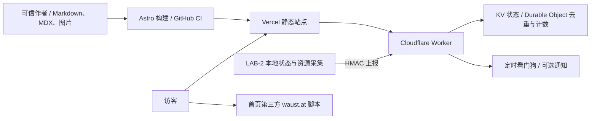

# 博客架构与安全审查

日期：2026-09-13。代码基线：43aeea1，加工作区已有的 5 项监控文档/systemd 修改。本次只检查并新增审计材料，未修复、提交或部署。

## 架构及信任边界

静态页面没有站内登录、数据库查询或上传入口。主要安全边界在构建输入、公开 Worker、第三方脚本、托管账户和服务器采集环境。Worker 不能从接口直接控制实验；博客与 LAB-2 的联系是采集器主动推送。

## 优先处理

### 1. 高优先级：依赖命中已公开的图片处理漏洞

联网执行 `pnpm audit --json`，注册表返回 24 项：critical 1、high 12、moderate 10、low 1。原始回执见 dependency-audit.json。数量是依赖公告命中数，不是 24 条已证实的线上攻击路径。

锁文件中的 Astro 7.0.2 命中 GHSA-26w7-cxv4-gfx2；直接 Sharp 0.35.3 及传递版本也命中公告。恶意 AVIF 进入优化流程可能造成代码执行。官方修复为 Astro 7.2.8 / Sharp 0.35.4：

- https://github.com/advisories/GHSA-26w7-cxv4-gfx2
- https://github.com/advisories/GHSA-rgj7-g3m4-5g8c

本项目采用静态输出，无已发现的公开动态图片优化入口。现实边界是本机/CI 构建处理外部图片；未投放恶意图片或验证代码执行。仅升级顶层 Sharp 不保证消除 Astro/工具链自己的旧传递版本，应整体更新锁文件并复审。其余命中包含 YAML/TOML 解析、PostCSS、SVGO、开发工具 Undici，需按实际调用条件判断，不能一律算成生产服务可利用漏洞。

### 2. 中风险：公开统计可伪造，单条存储随访客增长

证据：status-worker/src/index.ts:195-205、212-249、537-539、575-600。

访客身份是 X-Forwarded-For/CF-Connecting-IP 与 User-Agent 的无密钥哈希。User-Agent 由请求方控制，改变它即可产生新身份，不依赖 X-Forwarded-For 是否被边缘代理改写。统计入口无需鉴权且没有独立限流；状态上报的限流不覆盖统计入口。每个新身份追加到当天 visitors 数组，每次访问读取/查找/写回整个值，连重复访问也写入。攻击者可刷高计数并放大存储与请求成本；增长最终受平台限制约束，可能导致写入失败，而非物理无限存储。

建议：按可信网络标识做独立限流、减少客户端可控身份因素、设置有界去重结构及过期策略、避免无变化写入。统计与监控虽然是不同 DO 实例，仍共享 Worker 部署和账户资源。不能把此计数当可信独立访客指标。

### 3. 中风险加固项：首页第三方脚本拥有页面执行权限

证据：src/pages/index.astro:340；vercel.json:1-15；线上首页 HEAD。

首页直接加载 https://waust.at/m.js，无 integrity 固定内容。线上 HEAD 返回 HSTS，但未见 Content-Security-Policy、X-Content-Type-Options、Referrer-Policy 或防框架嵌套策略。第三方一旦被篡改，可在页面上下文运行代码；目前没有第三方已被攻陷的证据。

建议优先移除该脚本或使用受限沙箱 iframe；可固定版本时再考虑自托管/SRI。补 CSP 时需要处理当前内联脚本并先验证兼容性。仅把第三方域加入 CSP 白名单不能防住该域自身被攻陷。

### 4. 中低风险：发布图片流程可越出文章目录改名

证据：scripts/post-images.mjs:66-99；scripts/publish-post.mjs:56-60。

本地临时目录实测：文章引用 ../outside.webp，该文件实际是 PNG。调用 preparePostImages 后，文章目录之外的文件被改为 outside.png。路径只经 path.resolve，未检查允许目录及符号链接。影响限于运行发布脚本的本地权限和 Sharp 可识别图片，不能据此宣称远程任意文件写入或任意目标重命名。

建议明确允许的媒体根目录，用 realpath 验证源与目标的包含关系，在产生文件变更前完成全部校验。单一可信作者下主要是误操作风险；导入别人文章会放大风险。

### 5. 中风险可用性缺口：请求体上限发生在完整读取之后

证据：status-worker/src/index.ts:217-220、460-468。

统计入口先 request.text()，再检查 1 KiB；状态入口先检查 Content-Length，但缺失时仍完整读取后才检查 8 KiB。最终返回 413 不等于读取时内存有界。未进行生产大请求或耗尽测试。

建议采用流式字节计数并超限取消读取，结合边缘请求大小/速率限制；状态入口可先做廉价的签名头与时间检查，但验签仍需准确原始字节。

## 已观察到的运行问题

公开 GET /api/lab2/status 返回 HTTP 200，freshness.state=offline、ageSeconds=2204298，约 25.5 天没有新数据。原始响应头及摘要另存。HTTP 200 表示接口可访问；不能证明采集器正常，也不能单凭该数据判定 LAB-2 真实离线。需要随后核对实际采集目标、timer、上报回执和 Worker/KV 绑定，排查旧部署/旧数据/停报。此次未登录 LAB-2，也未检查私有监控或通知账户。

## 次要架构问题与待核实项

- 采集器 collect_status.py:214-218 不限制本地状态文件大小/类型；若该文件可被替换为 FIFO，可能阻塞。systemd 应配置适当启动超时，文件权限与普通文件校验需明确。这要求本地写权限。
- 看门狗 index.ts:416-457 的发送通知与 KV 状态更新不是原子操作，重叠执行可能重复通知。
- path 事件上报可能放大请求；现有文档已提示免费配额下禁用，不能把仓库存在 unit 当成线上已启用。
- Vercel buildCommand 只构建；GitHub workflow 会测试。未读取托管控制台/分支保护，尚不能确认 CI 成功是生产发布的强制门禁。建议核实 required checks、预览环境 secrets、最小权限及账户 MFA。
- CI Actions 使用版本标签、没有显式 permissions；可固定提交 SHA 并设置 contents: read。当前未发现利用证据。
- MDX 是可信代码输入，不应当作不可信用户投稿格式直接构建。现有单作者工作流本身不因此构成漏洞。
- 本次基础密钥模式扫描未发现匹配，不涵盖 Git 历史、图片中的凭据或云端 secrets，不能认证“无泄露”。

## 已验证的保护与检查

- 状态上报具备 HMAC、时间窗、重放检查、独立 DO 限流、schema 与公开字段投影；上限读取问题另见上文。
- 前端状态使用 textContent，未发现来自公开状态接口的直接 HTML 注入路径。
- 页面路由过滤 draft；生产构建成功生成 14 页。
- 站点测试 15/15、Worker 类型检查及测试 13/13、采集器测试 14/14 通过，共 42 项。功能回归通过不等于安全认证。
- 两个 Luna 分工检查前端/后端与测试，主代理复核关键源码、线上只读响应、依赖公告并在临时目录复现图片越界；这不是独立渗透测试认证。

建议顺序：升级易受攻击依赖 → 修复统计去重与限流/流式请求体边界 → 第三方脚本隔离与安全头 → 修复发布路径边界；监控停报作为独立运行故障排查。
