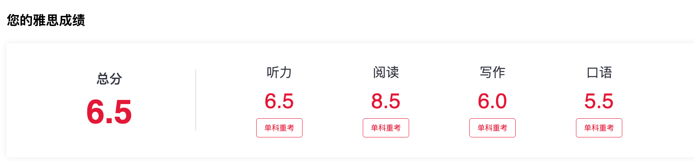

# 随手小记-0721

## 雅思通过

花了大概35天的时间，疯狂恢复英语，终于还是通过了雅思，但是很可惜差0.5分就可以总分上7了。 第一次考是6-27分数是5.5 6.5 6 5.5 第二次考是7-15 分数是6.5 8.5 6 5.5 。这里记录一下学雅思准备了什么，一开始做了一点点雅思哥但是要收费后面就果断切换到爱听写了，我个人练习的时候主力就是爱听写 基本上一天一套听力和阅读，分数基本上都是有稳步提升的。然后作文就是一天背模板，口语找了个菲教，但是这个菲教职业道德太差了，老是请假包括我即将考试的前几天也没给我安排课了，这里强烈不推荐找口语老师了，因为GPT的live已经足够强了。

第一次没上6.5后，我后面去收集了zyz和虾滑的真题来做，难度非常接近考场难度，以及我在真实考试中遇到了阅读P3和听力P2 但是这个听力P2有点忘了 所以听力还是没有发挥好。我推荐剑雅做到听力6.5 阅读7.5 就可以去刷机经了，比较高效以及贴近真实考场难度。

关于做题的一些技巧：

1. 听力的填空主要是定位，你可以提前预判一下对应的词性和可能的词。
2. 听力的选择你可以记题干为英文 因为这是会100%出现的 可以用于定位。然后选项可以在脑子里转换成中文，这样方便同义替换。
3. 阅读TF这类题目，没出现的才能选not given 其他情况都要认真考虑。以及第一道TF一般不会是not given 还有 True False not given 一般都会有出现。
4. 阅读 填空也是快速定位就行，阅读单选可以找到对应出处后选，一般都是比较合理的选项 也就是贴近文章整体意思的。

## 后面要解决的事情

1. 首先是申请需要的材料，本周在成绩出完后，应该就要把申请需要的一些东西都收集好。
2. 陪你读项目的测试以及真实使用后不断优化。
3. 无人机安全项目的大体规划 以及和老师对齐。
4. 多模态去重的算法整体升级，这个直接用codex来做了，整体的战线太长了已经有点失去意义了。
5. 机械臂项目的复现。通过这个项目入门具身智能。
6. 港中深相关课题组的调研。寻找感兴趣的方向和靠谱的老师。
