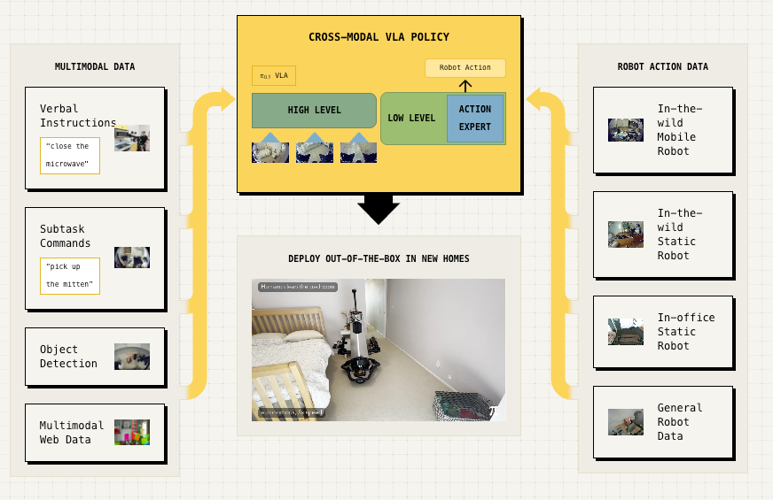
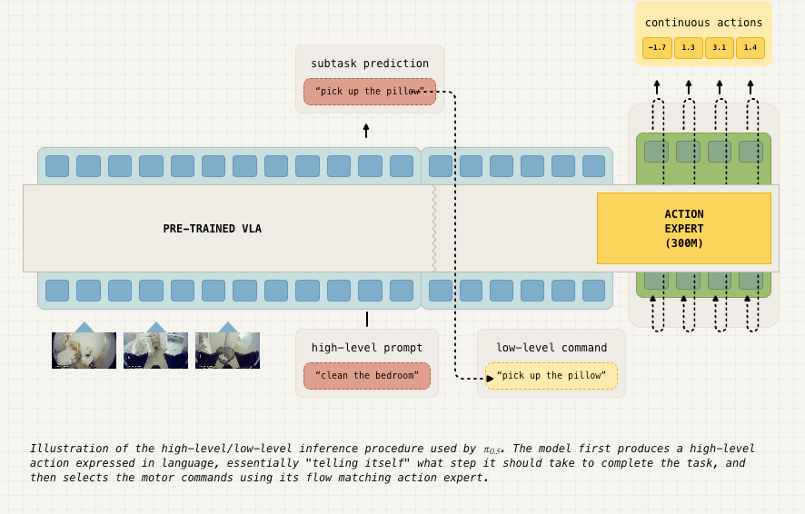
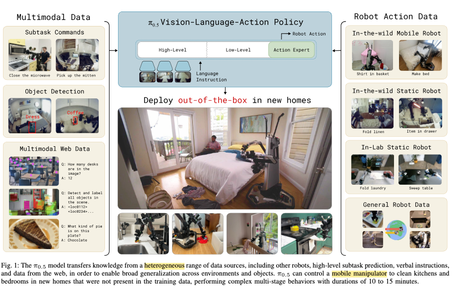
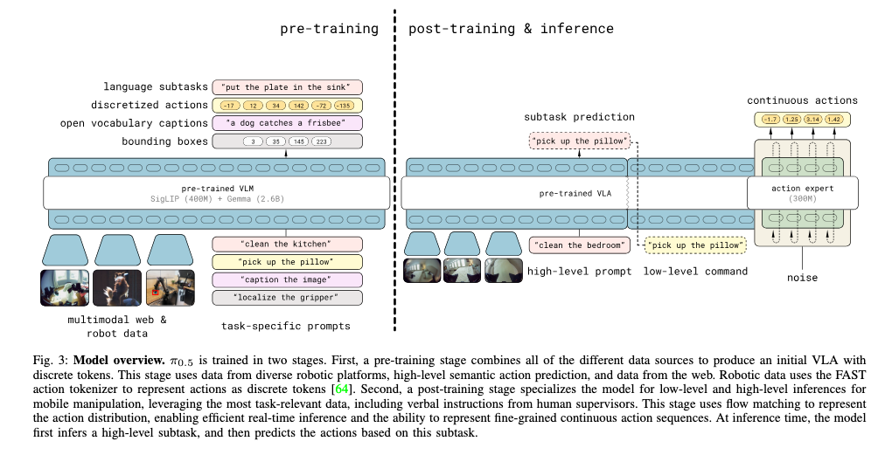
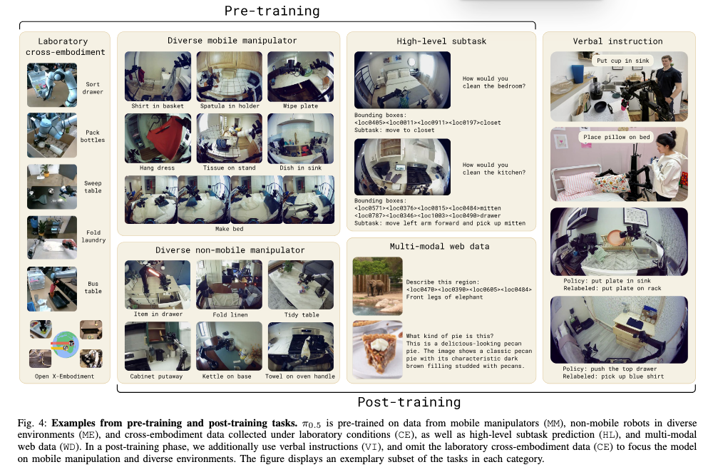
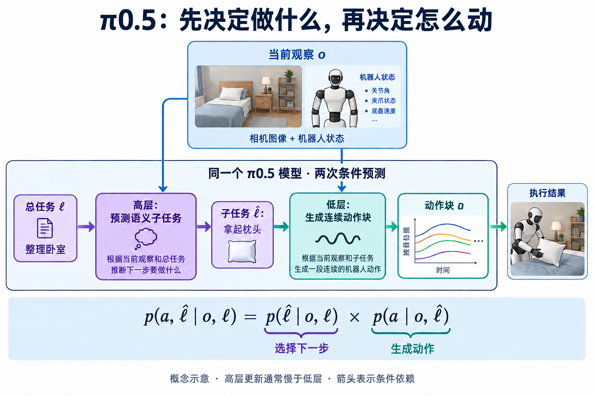
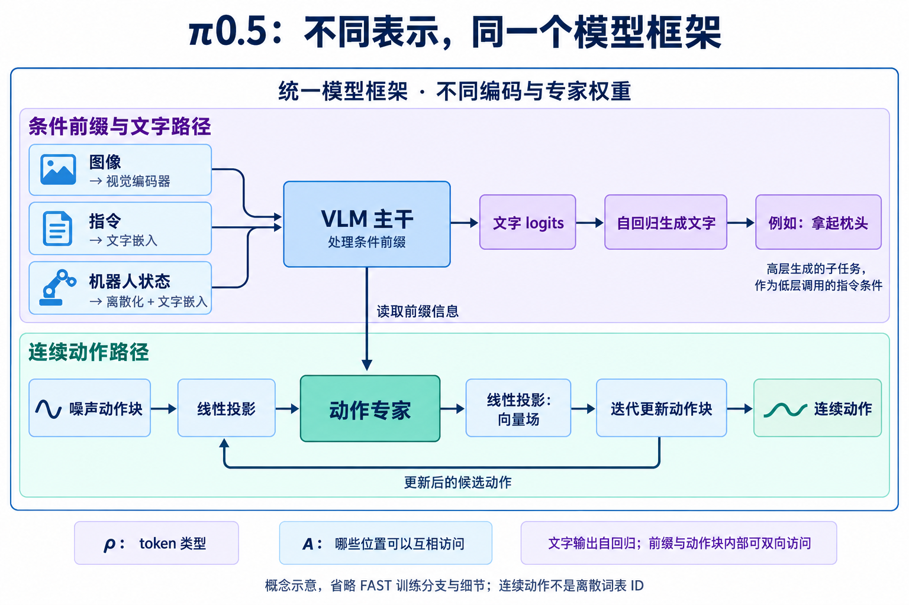
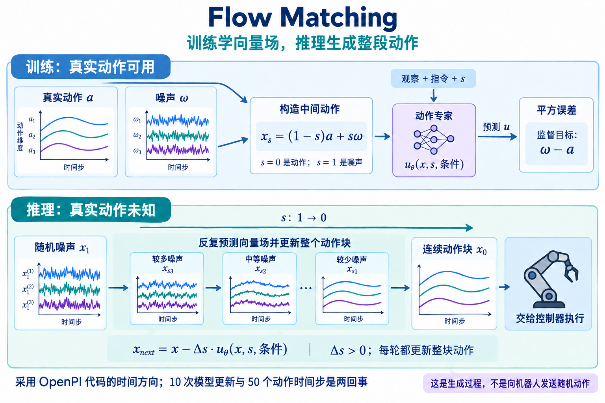
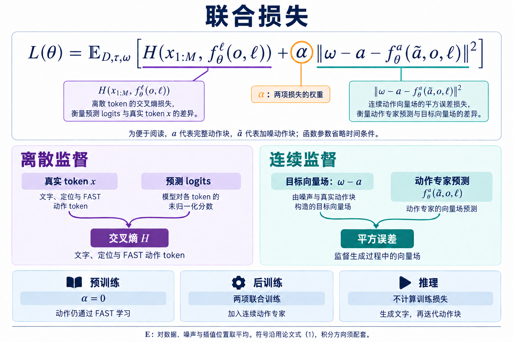
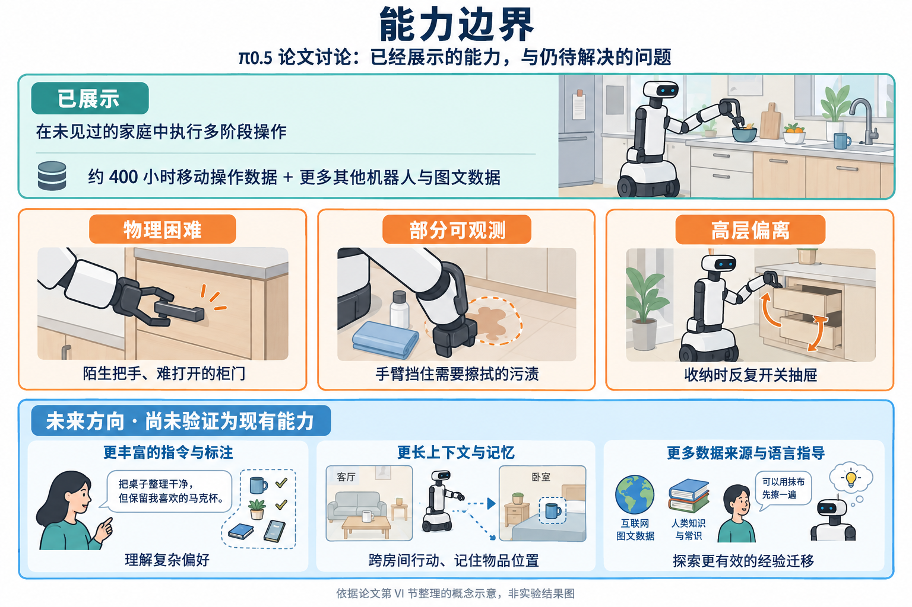

<!-- 写作状态：2026-09-13 汇总修订。合并 pi05_阅读笔记与技术文档.zip 中的问答整理版与技术文档，并按 humanizer-zh 润色。其他 AI 的解释仅作为阅读材料，技术判断以论文及官方实现为依据。保留文章标题；按本次反馈增加速查、短子标题、易错点及实现细节分层。尚未独立复现实验。2026-09-13 用户确认发布。 -->

读完 [π0.5 论文](https://www.pi.website/download/pi05.pdf)，我最在意的是它怎样把不同来源的知识用到机器人身上。网上的图文、其他机器人的动作、人给出的逐步指导，形式差得很远，却都参与了同一个模型的训练。

读[官网介绍](https://www.pi.website/blog/pi05)时，我一直没想清楚，为什么同一个模型既能决定“拿起枕头”，又能输出让机械臂运动的数值。读到训练部分，又碰到了 FAST 和流匹配：同样是动作，为什么要准备两种表示？这篇笔记就沿着这几个疑问整理。

## π0.5 一页速查

**结构简记：VLM + Action Expert。** 完整方法还包括异构数据协同训练与高低层推理。

| 环节 | 复习时先记住什么 |
| --- | --- |
| Pre-training | 异构数据共同训练；FAST 把动作编码成离散序列，参与 next-token prediction |
| Post-training | 保留离散 token loss，加入连续 Flow Matching Action Expert 与对应损失 |
| High-level | observation + 总任务 → semantic subtask，例如“拿起枕头” |
| Low-level | observation + semantic subtask → Flow Matching → continuous action chunk；这条路径不先生成 FAST token |
| Flow Matching | xₛ 是生成进度 s 下整个动作块的当前状态；网络预测 velocity，再用它更新 xₛ |
| Inference | 文字自回归生成；低层用 10 次向量场更新生成 50-step action chunk；高层更新频率低于低层 |
| RTC | 后来研究的实时动作块衔接方法；原论文定量结果采用同步执行 |

下面把这些关系展开。公式中的动作时间 t、生成进度 s 和训练步数各有用途，阅读时先分开。

## 异构数据

π0.5 背后的一个重要原则，是异构数据的协同训练。这里的“异构”，可以先理解为来源、形式和标注方式不同的数据。有些是图像与文字，有些带有物体位置的标注，还有些是机器人实际执行任务时采集的观察和动作。

这些数据分别提供不同的经验。机器人要清洁厨房，既需要知道怎样拿起物体，也需要理解哪些东西应该收起来、应该放到哪里。整理床铺同样如此：抓住枕头是一项具体技能，而判断什么时候处理枕头、整个任务应该怎样推进，则涉及任务的语义和结构。不同机器人采集的动作数据，也被纳入训练，希望帮助模型迁移已有的物理技能。



*异构数据协同训练示意图。来源：Physical Intelligence 官网。*

VLA 是视觉—语言—动作模型，可以理解为在视觉语言模型的基础上，进一步学习输出机器人动作。因此，训练数据可以包含图像、文本、动作，以及边界框等多模态标注，不要求每条样本都具备全部内容。

论文里有一句我觉得很重要的话：把不同模态放进同一个序列建模框架，VLA 就可以接受机器人数据、语言数据、视觉任务，以及它们的组合。

### 统一序列

可以把它理解成：先用适合各自模态的编码方式，把信息变成 Transformer 能处理的一串表示，再让模型根据前面的条件预测后面的目标。文字可以编码成离散 token ID，再查表得到向量；图像通常通过视觉编码器变成一串特征向量。这些序列元素可以有不同的表示形式。

用几个简化的训练样本来想会更直观：

| 样本提供的条件 | 要预测的目标 | 对应能力 |
| --- | --- | --- |
| 图片 + “描述这张图” | 图片描述文字 | 看懂场景并表达 |
| 图片 + “找出枕头” | 物体框的位置表示 | 定位物体 |
| 卧室观察 + “整理卧室” | “拿起枕头” | 选择语义子任务 |
| 机器人观察、状态 + “拿起枕头” | 编码后的动作序列 | 学习如何执行 |

表中的样本格式做了简化。目标虽然不同，却可以共用模型和序列预测的训练方式；没有动作标签的图片，也能参与视觉与语义训练。

于是，“网上的图文知识怎样帮助机器人”就有了一条可以理解的路径。图文样本帮助模型认识物体和场景，子任务样本帮助模型选择下一步，机器人轨迹则提供运动监督。它们通过共享模型发生联系。统一表示提供了共同训练的条件；泛化是否改善，还要看数据搭配和实验，不能仅凭“都变成 token”就得出结论。

这让我重新区分了两种标注：给模型看一张没整理好的床，标注“枕头”，和标注“拿起枕头”，教给模型的是不同的东西。“枕头”是在辨认物体；“拿起枕头”则是在告诉模型，面对这个场景，下一步适合做什么。官网举的高层行为标注属于后者。

此外，训练还包括人通过自然语言逐步指导机器人完成任务的示范。例如，人告诉机器人先处理哪个物体，再做什么。这样，模型能接触到语言指令与任务推进之间的关系。

## 语义动作

拿整理卧室来理解，高层处理的是**下一步做什么**，例如“拿起枕头”。论文把这类行为称为高层“语义动作”（semantic actions），用语言表达一个有意义的子任务。

低层处理的是**身体具体怎么动**，输出数值形式的 robot action chunk。高层也被作者称为 action，所以不能仅凭有没有 action 这个词判断层级。要完成拿枕头这件事，机器人需要生成连续的控制动作，让机械臂和夹爪完成接近、抓取和抬起等运动。

所以，“拿起枕头”虽然已经比“整理卧室”具体很多，但它仍然没有规定各个关节怎样运动。它是高层决策的结果，也是低层控制需要遵循的任务条件。

同一个模型能够承担这两种工作，与它接受的训练有关：训练中既有需要输出文字的任务，也有需要输出动作的任务。模型因此学会了两类输出。在结构上，官网还说明它有不同的解码路径：高层文字通过离散 token 的自回归解码生成，低层连续动作通过 flow matching 动作专家生成。“同一个模型”内部仍然可以有承担不同功能的部分。[来源：官网 Training and inference](https://www.pi.website/blog/pi05)



*高层与低层推理过程。来源：Physical Intelligence 官网。*

沿着图中的例子，可以这样读：

1. **输入当前观察，以及“整理卧室”这个任务。** 图中的 `clean the bedroom` 是输入给模型的 high-level prompt。总任务由外部给定，模型结合观察决定下一步。
2. **模型预测一个子任务。** 例如输出 `pick up the pillow`，也就是“拿起枕头”。图中的 `subtask prediction` 指的就是这个结果。框里的 `Pre-trained VLA` 指预训练过的 VLA 模型。
3. **把子任务作为低层控制的条件。** 图中虚线把“拿起枕头”接到了 `low-level command`。这里最容易混淆：同一句话，作为上一步的输出，是高层行为；作为下一步的输入，则是交给低层控制的命令。它此时仍然是文字，还不是关节控制数值。
4. **动作专家生成连续动作块。** 模型结合视觉观察和子任务条件，通过动作专家输出具体动作。不能把它理解成一个只接收文字、把“拿起枕头”机械翻译成固定动作的转换器。枕头在哪里、当前场景怎样，都会影响应该如何动作。

官网描述的动作块包含 **50 个时间步，对应 1 秒的连续低层关节动作**。50 指时间位置，关节等控制维度构成每个位置上的动作向量。下文统一用 K 表示动作步数；若把论文的 aₜ:ₜ₊H 按首尾均包含来数，则 K = H + 1。不要把动作长度与公式里的交叉熵 H 混在一起。

我原先说的“动作专家生成动作，再转换回关节空间”，也需要收得更准确一些。不能仅凭示意图额外假设一个转换步骤。论文的动作数据涉及关节和末端位姿两种控制表示，实际移动机器人还包含底盘速度等控制量。因此，“低层动作”应当理解为对应机器人控制接口的数值目标，不能一概写成关节角，也不能直接等同于电机电流。[来源：π0.5 论文 IV-C、IV-E](https://www.pi.website/download/pi05.pdf)

官网把这种先产生语言子任务、再生成动作的过程，类比为一种思维链。我目前更愿意把它理解为：机器人先明确“这一阶段要做什么”，再据此控制身体。这张图展示了一个语言形式的中间步骤，并没有展示一整段复杂的文字推理。



*论文中的异构数据总览。来源：π0.5 论文 Figure 1。*

论文的引言也把两类知识的来源联系到了高低层分工上：其他机器人采集的动作可以帮助低层行为学习；图文中的语义知识、子任务标注和人类逐步给出的语言指导，则帮助模型决定下一步应该做什么。这里描述的是不同数据的主要用途，不能理解成它们各自训练一个完全隔离的模型。

## 两阶段训练



*模型的两个训练阶段，以及推理时的使用方式。来源：π0.5 论文 Figure 3。*

图左边写的是 `pre-trained VLM`，完整意思是“已经预训练过的视觉语言模型”。其中标出了 SigLIP 视觉编码器和 Gemma 语言模型。可以把视觉编码器理解为把图片转成视觉特征的部分，语言模型结合这些特征和提示词处理任务。它给机器人训练提供已有的视觉语言基础；机器人如何动作，仍需要动作数据来教。

图中的底座事先已接受视觉语言预训练；左半图的 `pre-training` 是在它之上继续用异构数据训练初始 VLA。

另一个容易看反的地方，是图上方的那些内容。**下方主要展示条件输入，上方展示要学习预测的输出目标。** `discretized actions` 指离散化后的动作。它与其他标签的作用可以这样对应：

| 图上方的目标 | 模型在练习什么 |
| --- | --- |
| language subtasks | 根据场景和总任务，选出下一步语义动作 |
| discretized actions | 根据观察和任务条件，预测经过 FAST 编码的机器人动作 |
| open vocabulary captions | 用文字描述图像，学习物体、关系与场景语义 |
| bounding boxes | 预测目标的位置表示，学习语言与视觉位置的对应关系 |

任务提示词和标签决定每份样本的预测目标。训练时通过 teacher forcing 提供真实的前序 token，计算后续位置的预测损失。

右边的 `post-training & inference` 把两个阶段画在一起，阅读时要拆开：后训练仍然使用标签更新参数；推理则使用训练好的模型生成子任务和动作。

后训练加入一个随机初始化的动作专家，用流匹配学习连续动作，同时保留 next-token prediction；后者仍涵盖文字和 FAST 动作监督。数据更聚焦家庭移动操作，保留相关机器人、图文和子任务数据，并加入人类逐步指导的语言示范。因此，这一步既在适应目标场景，也在训练连续动作生成能力。[来源：π0.5 论文 IV-B、IV-D](https://www.pi.website/download/pi05.pdf)

### 数据配方



*训练数据示例：上方括号覆盖预训练数据，下方括号覆盖后训练数据。来源：π0.5 论文 Figure 4。*

这张图值得沿着上下两个括号看。预训练从实验室跨机器人数据开始，覆盖中间的机器人、语义和图文任务；后训练不再包含最左侧的实验室跨机器人数据，转而加入最右侧的语言指导。

| 数据类别 | 预训练 | 后训练 | 主要提供什么经验 |
| --- | --- | --- | --- |
| CE：实验室跨机器人数据 | 使用 | 去掉 | 不同机器人与任务的动作经验 |
| MM：多环境移动操作数据 | 使用 | 使用，筛选相关轨迹 | 移动机器人在家庭中的实际操作 |
| ME：多环境非移动机器人数据 | 使用 | 使用，筛选相关轨迹 | 更丰富环境中的操作经验 |
| HL：高层子任务标注 | 使用 | 使用相关子集 | 根据观察和总任务选择下一步 |
| WD：多模态网络数据 | 使用 | 继续使用 | 物体、场景、问答和定位知识 |
| VI：语言指导示范 | 此阶段未加入该类数据 | 加入 | 人为机器人逐步选择合适子任务的示范 |

这里的 VI 和普通的语言指令要区分。预训练本来就有语言提示和子任务标签；后训练新增的是人在任务执行过程中逐步指导机器人形成的示范，不是到这时模型才第一次接触语言。

图中右侧还有 Policy 与 Relabeled 的对照。它说明标签可以表达“这个场景应当做什么”，而不必机械沿用原策略提出的子任务。比如图中把原来的“放进水槽”改标为“放到架子上”。读图时不要把这两行当作同一次正确执行的连续步骤。

后训练保留图文数据也很容易漏看：它并不是只剩下机器人动作微调，还要保留视觉和语义能力。表中描述的是数据类别与用途，不代表等比例混合，也不能据此推算每类数据的训练占比。

运行时，先生成语义子任务，再以观察、状态和子任务为条件生成连续动作。**这里不需要先生成一串 FAST ID，再把 ID 交给流匹配。** 论文还指出，高层推理的频率低于低层动作推理，所以不能把引言里的“先预测子任务，再预测动作”理解为每个控制时刻都重新生成一句子任务。[来源：π0.5 论文 II、IV-B](https://www.pi.website/download/pi05.pdf)

## 模型架构

### 条件分布



*架构示意 A：按论文的条件分布关系生成的解释图，非论文原图。图中省略时间下标与参数 θ；机器人外形仅用于示意。*

高层与低层的关系可以写成一个条件分布分解：

```text
πθ(aₜ:ₜ₊H, ℓ̂ | oₜ, ℓ)
    = πθ(aₜ:ₜ₊H | oₜ, ℓ̂) × πθ(ℓ̂ | oₜ, ℓ)
           低层动作分布             高层语义分布
```

竖线 `|` 读作“给定……条件下”。左边说的是：给定当前观察和总任务，模型对“文字输出与动作块”建立一个联合分布。πθ 表示参数为 θ 的策略模型。

| 符号 | 在这里指什么 | 整理卧室的例子 |
| --- | --- | --- |
| oₜ | 当前观察，包含各相机图像和机器人自身状态 qₜ | 看见床和枕头，也知道手臂、夹爪等当前状态 |
| ℓ | 总任务提示 | “整理卧室” |
| ℓ̂ | 模型输出的文字；在分层控制时是语义子任务 | “拿起枕头” |
| aₜ:ₜ₊H | 要生成的一段动作 | 接下来一段时间的机器人控制目标 |
| θ | 学到的模型参数 | 决定模型怎样根据条件预测输出的权重 |

从右侧的高层因子读起：πθ(ℓ̂ | oₜ, ℓ) 根据观察和“整理卧室”，预测“拿起枕头”。低层因子 πθ(aₜ:ₜ₊H | oₜ, ℓ̂) 再根据观察和这个子任务生成动作块。两个分布由同一个模型表示。

一般的概率链式分解会让低层同时以观察、总任务和子任务为条件。π0.5 的设计进一步省掉低层条件中的总任务 ℓ，让它通过语义子任务 ℓ̂ 影响动作。高层选错子任务时，低层即使准确执行，整体任务也可能失败。

> **⚠️ 易错点**
>
> - 两个因子描述同一模型的两种调用，乘法组合的是概率分布。
> - ℓ̂ 是输出文字；在分层控制中是子任务，在图文问答中也可以是答案。
> - 低层仍然使用当前观察，包括相机图像和本体状态，不是只把文字翻译成固定动作。

### Transformer



*架构示意 B：按论文生成的简化结构图，非论文原图。展示两类输出路径，不表示一次前向同时完成高低层调用；省略 FAST 监督分支、流匹配时间条件和逐层注意力细节。*

```text
y₁:ₙ = f(x₁:ₙ, A(x₁:ₙ), ρ(x₁:ₙ))
```

这里用小写下标 n 排版，对应原文的大写 N，也就是序列元素总数。这个式子可以读成：模型 f 接收一串输入，还需要知道“哪些位置可以互相看见”和“每个位置是什么类型”，然后得到各位置的输出。

- `x₁:ₙ` 是输入序列。文字使用离散 ID，图像由视觉编码器处理，流匹配动作则保持连续表示，投影后形成 continuous action embedding。论文宽泛地把这些 sequence elements 都称为 token；本文只在离散编码处强调 token ID。
- `ρ(xᵢ)` 表示第 i 个序列元素的类型，用来决定怎样编码、使用哪部分专家权重。
- `A(x₁:ₙ)` 表示注意力的可见关系，即一个序列位置是否可以访问另一个位置。它规定注意力掩码或连接规则。
- `y₁:ₙ` 是处理后的输出序列，不是 n 条最终机器人指令。不同位置的输出有不同用途。

文字 ID 通过 embedding 查表成为向量；图像通过视觉编码器得到特征；连续动作通过线性投影进入动作专家的表示空间。统一序列不要求它们使用同一个原始编码器，也不要求所有位置完全共用一套权重。

论文说观察与任务提示构成 prefix，也就是输入中的条件前缀。可以把前缀理解成“这次预测已知的信息”，后续输出以它为依据。在高层调用中，任务条件是总任务；在低层调用中，则由前面预测的子任务承担指令角色。

这里的双向注意力也要限定范围。输入前缀内部、连续动作块内部可以互相访问，生成文字仍然遵循自回归规则，不能偷看尚未生成的答案。动作块中未来时刻的位置，是模型内部正在生成的候选动作，允许它们相互建模，并不意味着机器人看到了未来相机画面。具体哪些组之间允许访问，由注意力掩码规定，不能理解为整个序列完全互通。

模型的输出随后分成两类：文字位置输出 logits，即每个候选 token 的未归一化分数，据此得到分布并生成文字；动作位置由动作专家处理，再经过线性映射得到流匹配所需的连续输出。结合下一节的定义，这个连续输出用于构造向量场，通过迭代更新得到动作块，不能把每次 Transformer 的原始输出都直接当成已经完成的关节目标。[来源：π0.5 论文 III、IV-A 与附录 E](https://arxiv.org/html/2504.16054v1)

原文的 `M + H ≤ N` 则是在说明，序列中并非所有位置都单独承担输出损失：一部分位置主要提供条件，另一部分位置负责文字或动作预测。没有单独的输出损失，不代表条件位置不参与计算，也不代表它们的相关参数不会通过反向传播更新。这里沿用作者的输出长度记号，不用它来反推动作块的执行频率。

最后一个很容易漏掉的细节是：论文把机器人的本体状态离散化，再作为文字 token 输入。状态回答“机器人现在怎样”，动作回答“接下来要怎样控制”，二者即使都来自数值，也不能混为同一种监督目标。

## 动作表示

这里先约定用词：hard 指确定的离散 ID；soft 在这段讨论中泛指连续表示，并不是论文为所有模态规定的一套 tokenizer 分类。表示是否离散，与预测是否使用概率分布，是两个问题。

真实动作经过 FAST 量化和编码后，会得到确定的整数 ID，这是硬离散编码。模型则根据观察和指令预测这些 ID 的概率，训练时用交叉熵监督。因此，观察到动作的映射是学出来的，不能把“硬编码”理解成人工写好了场景到动作的查找表。

视觉特征和流匹配中的动作表示可以保持连续。离散 ID 进入网络后也会查 embedding 表变成向量，这不改变其离散编码的性质。π0.5 的动作专家直接学习连续生成过程，不是对几个 FAST ID 做加权平均。准确的概括应当是“不同模态进入同一序列建模框架”，而不是“所有模态先变成同一种离散词”。

## FAST

FAST 首先解决的是动作序列中的冗余。控制频率越高，相邻时刻的数值越可能接近；如果逐时间步、逐维分箱，模型有时只要复制前一个 token 就能得到较低损失，却未必学到了动作如何随场景变化。FAST 用压缩后的表示减轻这种相关性。[FAST 论文 IV](https://arxiv.org/html/2501.09747v1#S4)

FAST 编码的是一个动作块。假设一个教学例子有 50 个时间步、7 个动作维度，原始数据就是一个 50 × 7 的数值表。如果每个数都单独编码，会得到很长的序列。相邻时刻的运动常有连续性，这给压缩留下了空间。

**动作块归一化 → 各维沿时间做 DCT → 系数缩放并取整 → 按低频优先展开 → BPE 压缩为 token ID。** [来源：FAST 官方介绍](https://www.pi.website/research/fast)

DCT 是离散余弦变换。可以想象把某个关节的一段变化曲线，改写成几种不同频率的余弦曲线相加：低频描述整体变化，高频补充细节。它只是改变表示方式，本身并不等于删去信息。

FAST 随后缩放系数并取整，小系数可能变成零，这一步引入有损量化。再把各动作维度的低频系数优先排成序列，交给 BPE 合并常见的相邻符号组合。BPE 对这串量化后的符号做无损压缩；误差主要来自前面的量化。需要还原时，反向执行 BPE 解码、系数还原与逆 DCT，得到近似动作块。[来源：FAST 论文 V-B](https://arxiv.org/html/2501.09747v1#S5.SS2)

### 训练与部署

**FAST 本身可以用于动作推理，例如 π0-FAST；但 π0.5 部署时的低层动作路径直接使用连续 Flow Matching Action Expert，不需要先生成 FAST token。** 两者的取舍，要从训练和部署各自的计算方式看。

训练时，真实目标序列已知，可以用 teacher forcing，在因果掩码下并行计算各位置的预测损失。部署时，后面的 token 依赖前面实际生成的结果，通常要逐个解码。于是，“训练快”和“推理快”不一定同时成立。

FAST 论文的比较给了一个具体例子：在其 NVIDIA 4090 实验设置下，FAST 路径每个动作块约需 750 ms，而连续动作专家路径约需 100 ms。前者通常要用完整语言主干解码 30–60 个动作 token，后者进行 10 次较小动作专家的更新。这是该实验的结果，不是 π0.5 在所有硬件上的速度保证。[FAST 论文 VI-E](https://arxiv.org/html/2501.09747v1#S6.SS5)

π0.5 因而把两者分工：用离散表示进行高效协同训练，部署时用连续动作专家生成细粒度动作。FAST 仍能推理，经过优化的自回归模型也可能更快；论文选择的是当时适合实时控制的方案，而不是证明连续生成永远更好。[π0.5 论文 IV-B](https://www.pi.website/download/pi05.pdf)

| 环节 | FAST 离散路径 | π0.5 连续动作路径 |
| --- | --- | --- |
| 训练目标 | 动作 ID 的交叉熵 | 向量场的回归损失 |
| 生成方式 | 逐个预测 token，随后解码 | 每轮共同更新整个动作块 |
| 主要取舍 | 方便与文字联合训练，推理有串行解码开销 | 增加动作专家训练，部署时避免长动作 ID 序列 |

连续输出避免了最终动作受 FAST 量化精度限制，但仍然存在模型预测和数值积分误差。

> **⚠️ 易错点**
>
> - FAST 的频率是动作曲线的频率成分，不是控制频率。
> - 一个 FAST token 是压缩符号，不固定对应某个关节、时间步或语义技能。
> - π0.5 的低层部署路径直接生成连续动作；FAST 能用于其他模型的推理，不代表这里要先走 FAST。

## Flow Matching

**xₛ 是生成进度 s 下，当前整个 action chunk 的状态。** 假设动作块有 K = 50 个时间步、d 个控制维度，xₛ 就是一张 50 × d 的数值表。s 改变时，更新的是这整张表。

先分清三个时间尺度：

| 记号 | 表示什么 | 例子 |
| --- | --- | --- |
| aₜ 中的 t | 机器人真实轨迹中的物理时间位置 | 动作块的第 1、2……50 个控制时刻 |
| xₛ 中的 s | Flow Matching 的生成进度 | 当前候选动作块走到了噪声与动作之间的哪一处 |
| training step | 优化模型参数的训练步数 | 第几次用一批训练样本更新权重 |

### 核心原理

模型输入是**当前 xₛ + 图像与机器人状态 + 指令 + s**。在低层调用中，指令就是语义子任务。模型输出 velocity vθ，描述当前动作块应如何随生成进度变化；它不是最终动作，也不是机器人末端在现实中的运动速度。

```text
v = vθ(xₛ, s, observation, instruction)
x_next = xₛ + Δs · v
```

用 velocity 更新整个动作块，重复若干次，最终得到动作。下面沿用 OpenPI 的时间约定，s = 1 是噪声端，s = 0 是动作端，因此 Δs 为负；正负号的推导放在后面的实现细节。

```text
训练时：xₛ = (1 − s)a + sω
        a 是真实动作块，ω 是同形状噪声
推理时：从 x₁ = ω 出发，逐步更新到 x₀
```



*流匹配示意：采用 OpenPI 代码的时间方向。曲线仅示意生成过程，并不要求真实动作一定平滑，也不保证每一步的误差单调下降。*

图中的曲线对应同一动作块在不同生成阶段的状态。每一轮更新都会共同处理 50 个时间位置，而最终控制器沿物理时间逐步执行这些位置上的动作。

训练时从真实动作 a、噪声 ω 和随机进度 s 构造 xₛ，监督网络预测对应的向量场。一次训练可以直接抽取某个中间位置计算损失。

推理时从噪声开始，反复预测向量场、更新动作块。到达动作端后，才把结果交给控制器。π0.5 采用 10 次这样的更新。

为什么不直接回归一个最终动作？同一个观察下可能存在多种可行轨迹。连续生成模型学习条件动作分布，噪声允许生成不同候选；一次确定性回归则容易在多种示教之间取平均。这是理解生成式策略的直觉，并不代表任意噪声都一定生成可执行动作，也不构成“流匹配必然优于其他生成模型”的证明。对 π0.5 来说，它同时满足了连续动作建模与较低部署开销的需求。

> **⚠️ 易错点**
>
> - 10 次向量场更新处理的是同一个候选动作块；50 步描述最终动作序列的长度。
> - velocity 的单位随动作表示和生成参数而定，不等于机器人的物理速度。
> - 本文用“向量场更新”描述 Flow Matching。论文也使用 denoising 一词，但这个称呼不足以区分它与 Diffusion Policy 的训练目标和采样过程。

## 联合损失



*联合损失示意：完整展示式（1）的两项结构，a 与 ã 分别简记真实、加噪动作块；非论文原图。时间参数在函数记号中省略。*

前面的联合分布描述模型如何组织预测；这里的式（1）则是训练目标，用来衡量预测错得有多大，并据此更新参数。为了让公式容易读，下面把整个真实动作块 aₜ:ₜ₊H 暂记为 a，把加噪后的动作块记为 ã：

```text
L(θ) = E[D, τ, ω] { H(x₁:ₘ, fθᶫ(o, ℓ))
                    + α ‖(ω − a) − fθᵃ(ã, o, ℓ)‖² }

     = 平均下来：离散 token 预测损失 + α × 连续向量场预测损失
```

这里沿用论文式（1）的符号方向。两项分别监督离散预测与连续向量场。

| 符号 | 在这个损失中的含义 |
| --- | --- |
| D | 训练数据分布，提供观察、指令和相应监督目标 |
| τ | 加噪／插值的位置，不是机器人轨迹中的物理时刻 t |
| ω | 随机高斯噪声，与动作块具有相同形状 |
| x₁:ₘ | 要预测的真实离散 token 序列，包括文字或 FAST 动作 token |
| fθᶫ | 离散输出路径，给出候选 token 的 logits |
| fθᵃ | 动作专家的连续输出，在此监督为向量场 |
| α | 连续损失的权重，用来调整它相对离散损失的影响 |

最外面的 E 表示对数据样本以及随机抽取的 τ、ω 求期望。实际训练用一批样本近似这个平均。同一条真实动作可以与不同噪声、不同插值位置配对，让模型学会处理生成过程中的多种中间状态。没有动作标签的图文样本，可以参与离散预测训练，不需要凭空补一个动作监督目标。

第一项 H 是交叉熵，不是动作预测时域里那个 H。它检查模型有没有给正确 token 足够高的概率。举个假想例子，正确的下一个 token 是某个 FAST ID：模型给它 0.8 的概率，比只给 0.1 的概率受到的惩罚更小。文字子任务、图文答案和离散动作，都可以通过这种方式学习。

第二项是平方误差，比较目标向量场 ω − a 与动作专家预测值。这里的 a 是训练数据中已经知道的真实动作块，不是模型刚预测出来的动作。模型看到的是中间状态 ã，训练系统则用真实动作和采样噪声构造监督目标。公式在动作块各时间位置、各控制维度上衡量向量场误差，不是直接比较最终执行结果是否抓到了枕头。

### 损失权重

| 阶段 | 使用这个目标的方式 | 在学什么 |
| --- | --- | --- |
| 预训练 | α = 0，以交叉熵为目标 | 用统一离散输出学习文字、定位和 FAST 动作等任务 |
| 后训练 | 保留离散损失，加入有权重的连续损失 | 同时保留 token 预测能力，并训练连续动作专家 |
| 推理 | 不计算训练损失，也不使用真实动作标签 | 生成语义文字，再用动作专家迭代生成动作块 |

论文在后训练中采用 α = 10。实际训练效果还取决于两项损失的尺度、归一化方式和梯度。[来源：π0.5 论文 IV-D](https://arxiv.org/html/2504.16054v1)

> **⚠️ 易错点**
>
> - 交叉熵项也监督 FAST 动作，α = 0 时已经在学习动作。
> - α = 10 是损失权重，不是“动作能力重要十倍”。
> - 两项损失相加用于训练参数，推理时不计算它们。

### 实现细节：OpenPI 的负步长

为了知道 ã 是什么，需要连着看前面的插值式：

```text
ã = τ a + (1 − τ) ω

τ = 0：纯噪声
τ = 1：真实动作
中间值：噪声与真实动作的混合
```

只看一个数的教学例子：假设真实目标 a = 0.6，噪声 ω = −0.2，τ = 0.25，那么 ã = 0。训练中模型接收这个中间值以及场景条件，学习对应的向量场目标；它并不会在推理时直接拿到真实答案 0.6。τ 的信息也参与动作专家计算，公式的函数参数写法做了简化。[来源：π0.5 论文 IV-B 与附录 E](https://arxiv.org/html/2504.16054v1)

实现时需要把论文与代码的时间方向分开。上面的插值随 τ 从 0 到 1，由噪声走向动作，导数是 a − ω；式（1）的目标却写成 ω − a，方向相反，不能直接把它按正步长加回去。

我核对的 [OpenPI 实现](https://github.com/Physical-Intelligence/openpi/blob/main/src/openpi/models/pi0.py)使用反向时间。这里使用前文的 s；代码中的 dt 就是核心原理中的 Δs，vθ 表示动作专家预测的向量场：

```text
x_s = (1 − s)a + sω
u_target = ω − a

s = 1：噪声；s = 0：动作
推理从 s = 1 走向 0，dt < 0
x_next = x + dt · vθ(x, s, 条件)
```

这样，插值导数、监督目标和负步长便配套了。比如只看一个数，a = 0.6、ω = −0.2，理想向量场为 −0.8；若 dt = −0.1，一次更新会使数值增加 0.08，朝动作端靠近。实际推理没有真实 a，向量场来自网络预测，这个数值例子只是解释符号方向。

对应代码的 `compute_loss` 构造混合状态与目标；`sample_actions` 从噪声开始，使用负步长更新，默认 10 次，并缓存条件前缀。这次核对的是公开动作路径的实现，不等于确认开源配置复现了论文全部异构数据协同训练流程。

## ACT、Diffusion Policy 与 π0.5

读过 [ACT](/blog/2026-09-12-act-paper-reading-notes/) 后，可以用下表对照三种方法。这里比较原论文中的基本设定，π0.5 的“动作表示”一行专指部署时的低层输出。

| 对照项 | ACT | Diffusion Policy | π0.5 |
| --- | --- | --- | --- |
| 输出单位 | Action chunk | Action chunk | Action chunk |
| 部署时的动作表示 | 连续 | 连续 | 连续；训练另有 FAST 离散监督 |
| 生成方式 | 给定观察与 z，前向预测动作块 | 迭代去噪生成动作序列 | 沿向量场迭代更新动作块 |
| 建模核心 | CVAE + Transformer | 条件扩散模型 | VLM + Flow Matching Action Expert |
| 预训练 VLM | 无 | 原方法不依赖 VLM | 有 |
| 语言条件 | 原设置不是语言条件策略 | 原设置以视觉或状态条件为主 | 总任务与语义子任务参与推理 |
| 多种可行动作的建模 | 训练时用 CVAE 潜变量；原部署固定 z = 0 | 条件扩散分布 | 条件流匹配分布 |

ACT 的一次前向预测与 CVAE 训练并不冲突；它在原部署中固定潜变量，而非逐次采样动作风格。Diffusion Policy 与 π0.5 都迭代生成动作，但学习目标和采样更新方式不同。表中的“多种可行动作”指动作分布的多峰性，例如从左或从右绕行，与图像、文字这些输入模态是两回事。[ACT 官方说明](https://tonyzhaozh.github.io/aloha/)、[Diffusion Policy 官方说明](https://diffusion-policy.cs.columbia.edu/)、[π0.5 论文](https://www.pi.website/download/pi05.pdf)

## RTC

生成出一段动作之后，还有执行时如何交接的问题。Physical Intelligence 在后来的 RTC 介绍中明确说明，π0、π0-FAST 和 π0.5 原始工作的定量结果采用同步执行：执行完一块，等待下一次推理，再执行下一块。部分演示视频使用过早期实时策略，但定量结果没有。这比只根据“50 步、1 秒”猜测调度方式更可靠。[来源：RTC 官方介绍及脚注 2](https://www.pi.website/research/real_time_chunking)

后来的 Real-Time Chunking（RTC）允许机器人执行旧动作块时生成新动作块，并利用重叠部分约束衔接。它解决的是推理延迟与动作交接；流匹配解决的是如何生成动作块。二者可以配合，但不能把后来的 RTC 当成 π0.5 原论文已有的完整部署方案。

## 能力边界



*能力边界示意：根据论文第 VI 节整理。下方是未来研究方向，不是已经完成的功能；语言指导本身已用于训练，未来方向是进一步扩展其监督方式。*

讨论部分补充了一个数据规模的边界：约 400 小时指的是移动操作数据。模型还使用了规模更大的其他机器人数据，并与网络数据、高层预测数据共同训练。因此不能把结果概括成“只用 400 小时就学会了这些能力”。作者强调的是，多种经验的迁移帮助了目标移动机器人。

局限也比“偶尔做错”更具体。陌生的抽屉把手可能让机器人难以操作，有些柜门在物理上就不好打开；机器人自己的手臂还可能遮住需要擦掉的污渍。这属于部分可观测问题：任务相关的信息未必一直出现在当前画面里，单次看图无法保证掌握完整状态。

高层子任务预测也会分心。论文举的例子是，机器人在收纳物品时反复开关抽屉。低层可能分别完成了开和关，高层却没能持续推进总任务。这与前面的条件分布分解正好对应：选好子任务本身就是可靠执行的一部分。

此外，论文使用的任务提示相对简单，不能由此推出它能稳定理解复杂偏好或很长的约束。作者提出，可以通过更细致、多样的标注扩展这类能力；更丰富的上下文和记忆，则可能帮助机器人跨房间行动，或记住物品放在哪里。这些属于未来改进方向，不能写成已经验证的功能。

最后，本文探索的是一种特定的异构数据组合，并没有证明它已经是最优配方。语言指导提供了继续扩展监督的可能，但哪些数据最有效、怎样搭配，以及引入记忆后能改善多少，都仍需要新的证据。[来源：π0.5 论文 VI](https://www.pi.website/download/pi05.pdf)

现在再看“一个模型为什么能同时做高层和低层”，我觉得关键已经清楚了。模型在训练中见过语义标签，也见过动作监督；架构允许它输出文字和连续动作，推理时再用子任务把两者接起来。FAST 让动作参与离散序列训练，流匹配则负责部署时的连续生成。把数据、表示和调用方式放在一起，才能看懂 π0.5。

至于它在具体硬件上能否稳定执行，仍要回到推理延迟、动作交接和实际场景。论文在新家庭中的结果，不能直接变成我们自己机械臂上的能力保证。

<!-- 后续完善清单：
- 细读数据配比和泛化实验，核对评价指标与消融结论。
- 如需复现，进一步固定高层更新调度和控制配置；同步动作块交接已由 RTC 官方说明核对。
- 已核对 OpenPI 动作路径的时间方向与积分；如讨论复现，进一步固定代码版本、配置和数据配方。
- 发布前统一图片质量与来源，替换带阅读工具浮窗的截图（目前仅归档未嵌入正文）。
- 压缩包中的重复问答已融入正文；LeRobot 存储格式属于版本相关实现细节，本篇不将其推广为 π0.5 论文设定。
- 按需要补充英文正文。
-->
