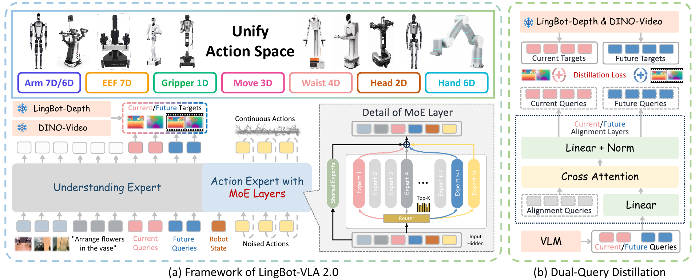
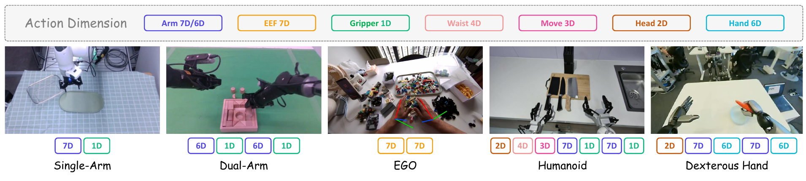
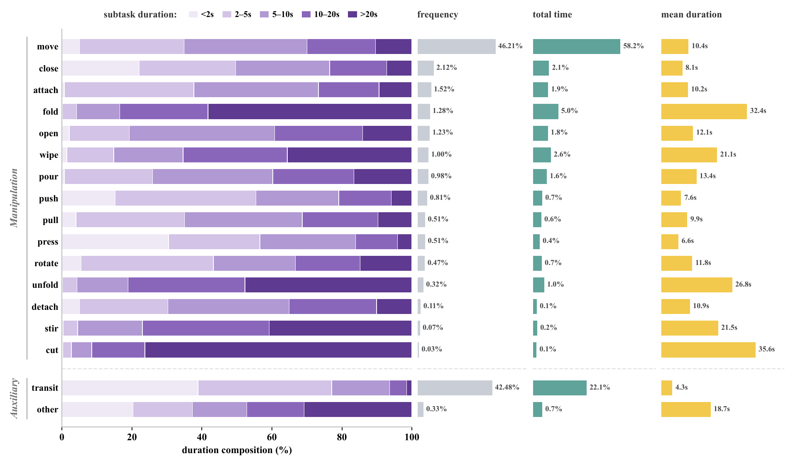
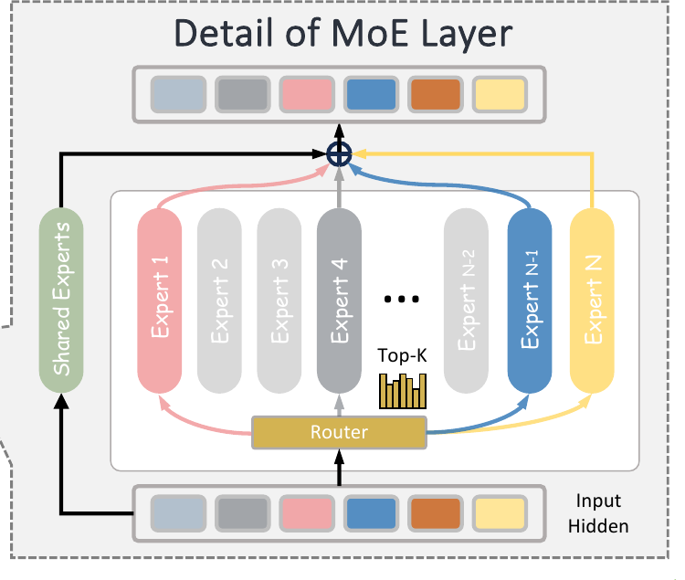
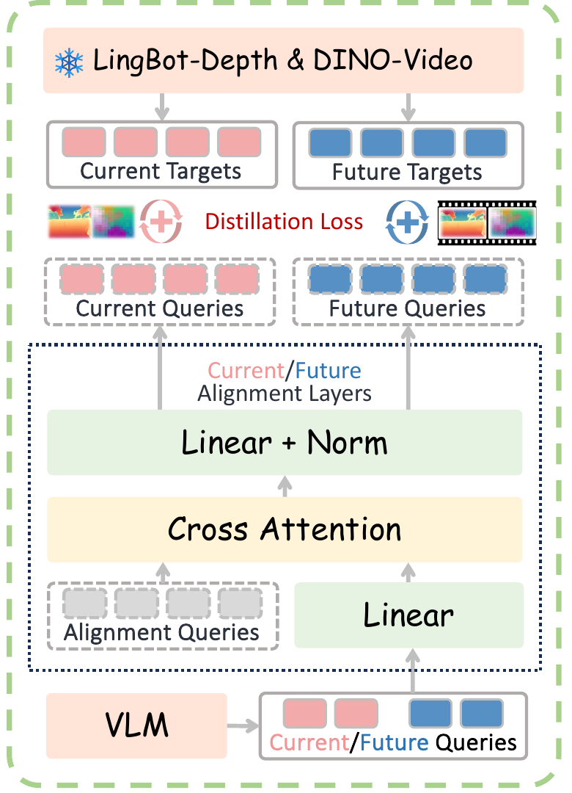

<!-- 阅读草稿，2026-09-22。由用户提供的阅读问答笔记重组，核对官方 2.0 论文及本地官方仓库固定版本。未独立复现论文实验，不代表比赛或真机验证结果。公式使用可读文本，与现有博客的无数学插件渲染方式一致。 -->

[LingBot-VLA 2.0](https://github.com/Robbyant/lingbot-vla-v2/blob/main/assets/LingBot_VLA_2_0.pdf) 面向跨任务、跨本体的机器人操作，在数据处理、动作表示和预测能力上改进了原有 VLA 系统。论文题目 *From Foundation to Application: Improving VLA Models in Practice*，也点明了它的关注点：让模型适应更复杂的实际操作场景。

理解这套方法，可以沿着一条具体的计算路径展开：**图像、语言和机器人状态怎样经过模型，最终变成一段可执行的动作。** 数据对齐决定监督是否可靠，统一动作空间容纳不同本体，MoE 加工动作表征，流匹配完成动作生成；未来时空监督则帮助模型学习场景变化。

## 核心思路

论文摘要将改进归纳为三个方向。

**泛化能力（Generalization）。** 模型要适应更多任务，也要适应不同的机器人本体。作者扩大并清洗机器人轨迹和第一视角人类视频，让训练覆盖更多身体结构、操作方式和场景，为跨任务、跨本体的泛化提供数据基础。

**扩展动作空间（Expanded Action Space）。** 实际机器人需要控制的部件可能超出双臂和夹爪。论文把头、腰、移动底盘和灵巧手也纳入统一表示，使模型能够表达更丰富的控制目标，支持需要多个身体部位配合的操作。

**预测动力学建模（Predictive Dynamics Modeling）。** 模型在理解当前画面的同时，学习预判接下来的场景变化。作者把未来预测设为辅助任务：DINO-Video 提供带有时间信息的视频表征，LingBot-Depth 提供深度与几何表征，用当前和未来的监督目标训练模型。这里预测的是未来表征，动作生成不需要先生成一段完整的未来视频。

数据处理、55 维动作表示和时空蒸馏，分别落实了这些设计。[来源：论文摘要](https://github.com/Robbyant/lingbot-vla-v2/blob/main/assets/LingBot_VLA_2_0.pdf#page=1)

## 阅读疑问

阅读中的几个关键问题，分别在下文展开。它们涉及表示、计算和监督三个层面。

| 疑问 | 对应解答 |
| --- | --- |
| Jerk 和 Z-score 分别检查什么？视频怎样与 state 核验？ | [数据对齐](#数据对齐) |
| 第一视角相机也在动，怎样还原手的轨迹？为什么要换坐标系？ | [第一视角数据](#第一视角数据) |
| 一维究竟指什么？Arm、EEF、Gripper、Hand 有什么区别？缺少的部件怎样补齐？ | [统一动作空间](#统一动作空间) |
| move、transit 占比很高，会不会主导训练？ | [动作分布](#动作分布) |
| Hidden state 是什么？Attention、FFN 和激活函数各做什么？ | [Hidden State](#hidden-state) |
| Expert 是独立模型吗？共享专家是否只处理简单任务？ | [专家结构](#专家结构) |
| 为什么用 sigmoid？偏置为什么只影响选谁、不直接参与加权？ | [路由与加权](#路由与加权) |
| 图像、状态、噪声动作和生成时间怎样进入模型？ | [模型输入](#模型输入) |
| MoE、Output Head 和最终 Action Chunk 是怎样连接起来的？ | [动作生成](#动作生成) |
| 一次前向得到 velocity 还是整个速度场？它是关节速度吗？ | [流匹配](#流匹配) |
| Transformer 层间更新与多轮流匹配有什么区别？ | [一次前向与多轮生成](#一次前向与多轮生成) |
| 多轮生成中哪些信息不变，为什么可以缓存？ | [前缀缓存](#前缀缓存) |
| 两个 Query 分当前和未来，还是分深度和视频？ | [双查询监督](#双查询监督) |
| Action Chunk 与未来表征有何区别？未来监督是否在“偷看答案”？ | [时空蒸馏](#时空蒸馏)、[训练与推理](#训练与推理) |
| MAE、MSE 与蒸馏损失有什么关系？ | [双查询监督](#双查询监督) |
| Table 3 在评估教师还是机器人？进度分与成功率有何区别？ | [实验评估](#实验评估) |

## 一页速查

| 环节 | 要点 |
| --- | --- |
| 数据规模 | 清洗后约 5 万小时机器人轨迹、1 万小时第一视角人类视频，机器人数据覆盖 20 种配置 |
| 动作表示 | state 和 action 都映射到 55 维固定表示，缺少的身体部位补齐 |
| MoE | 替换 Action Expert 的 FFN；每个 token 经过共享专家与少量被选中的路由专家 |
| 单次前向 | 动作块在当前生成位置上的 velocity；经过多次更新才得到完整动作块 |
| 双查询 | 一个对应当前、一个对应未来；二者都接受几何和视频表征监督 |
| 未来图像 | 用它构造监督目标；部署时没有真实未来帧可供读取 |
| 评测指标 | 教师表征、离线动作误差、机器人进度分和完整成功率需要分别看 |



*图 1：整体架构。截自论文 Figure 1，第 2 页。右侧蒸馏分支包含训练监督，不能把图中的所有箭头都当作部署输入。*

## 数据对齐

一条训练样本需要把当前图像、语言、本体状态，以及接下来的动作放在同一个时间关系里。State 描述机器人实际处于什么状态，action 描述控制目标。二者可能有跟踪延迟，不能只因为数值不同，就认定采集出了问题。

时间错位会直接影响监督质量。例如，记录的 state 显示夹爪已经到了杯子旁边，同一时刻的图像里却还离得很远。模型学到的视觉与身体位置关系就会出错。增加同类数据量并不能修复这种对应错误。

论文从约 9 万小时机器人数据中保留了约 5 万小时，处理过程同时检查运动信号和视频质量。[论文 §3.1.1](https://github.com/Robbyant/lingbot-vla-v2/blob/main/assets/LingBot_VLA_2_0.pdf#page=4)

### 轨迹异常

对位置序列做一阶差分，可以近似观察速度；二阶差分对应加速度；三阶差分对应 jerk，即加速度的变化率。在固定采样间隔下，三阶差分可以写成：

```text
Δ³qᵢ = qᵢ₊₃ − 3qᵢ₊₂ + 3qᵢ₊₁ − qᵢ
jerk ≈ Δ³qᵢ / Δt³
```

这里是便于理解的有限差分表达式。它帮助发现突然跳变和不平滑运动，但阈值与采样间隔、本体和信号单位有关，不能把一个机器人的阈值直接套给另一个机器人。

论文还计算**速度和加速度的 Z-score**。对某个待检查的值，Z-score 的基本形式是：

```text
z = (x − μ) / σ
```

Z-score 表示这个值离参考分布的均值有多少个标准差。论文并行检查 jerk，以及速度、加速度的 Z-score；任一指标超过阈值，就丢弃相应 episode。阈值按本体分别设置。

另一个规则针对几乎没有运动的 episode：如果所有 state 和 action 信号都只有小幅变化或保持不变的时段，占整条 episode 的比例超过 95%，就将它丢弃。这是整条轨迹的筛选规则，不能简化成“遇到静止帧就删除”。

### 视频与状态

只检查运动曲线还不够，视频可能模糊、掉帧，或者与状态记录不同步。作者结合 URDF 与记录的关节状态，把机器人投影到图像平面，再由标注人员检查它与画面中的机器人是否吻合。

投影结果让状态记录与视频能够相互核验。实际投影还需要对应的相机标定关系，URDF 自身并不包含完整的相机投影信息。

多相机错位、严重遮挡和视频模糊也在清洗范围内。这些问题需要单独检查，训练 loss 正常下降并不能证明输入已经正确对齐。

## 第一视角数据

机器人采集系统通常能直接记录状态和控制信号。人类第一视角视频未必有这些标签，而且相机本身也在运动。

设想手停在桌上，人转了一下头，画面里的手仍然会移动。如果直接把这种像素变化当成手的动作，就把相机运动也学进去了。

对没有动作标签的人类视频，论文通过第一视角 SLAM 估计相机内参和逐帧外参，再估计 MANO 手部参数，将相机坐标中的手部运动转换到世界坐标，得到连续轨迹。已经带有动作或手轨迹标签的数据，则主要进行时间、坐标和格式的统一，不必全部重新跑一遍重建。[论文 §3.1.2](https://github.com/Robbyant/lingbot-vla-v2/blob/main/assets/LingBot_VLA_2_0.pdf#page=6)

训练时的坐标变换见论文式（1）：

```text
p_τ^(Cₜ) = T_(Cₜ←W) · p_τ^W
```

`p_τ^W` 是世界坐标中的手位置，`T_(Cₜ←W)` 把它变换到当前观察时刻 t 的相机坐标系。若按点坐标展开，就是旋转加平移；用矩阵乘法写时，可以采用齐次坐标。

这里要分清 t 和 τ。t 是选来作为当前观察的那一帧，τ 可以是轨迹中的未来时刻。**同一段未来轨迹都转换到固定的 Cₜ 下**，而非每个未来点都跟着换到各自那一帧的相机坐标系。

世界坐标方便统一存储，当前相机坐标方便把动作目标与眼前图像联系起来。这个设计把手本身的运动与相机运动分开，也给不同来源的人类视频提供了共同表示。

重建出的轨迹仍是估计值。作者还检查有效手部帧比例、SLAM 稳定性、轨迹连续性和人体运动约束。这些检查用于排除几何重建不可靠的样本。

## 统一动作空间

不同机器人的控制接口很难直接拼在一起。单臂可能只控制手臂和夹爪，双臂多出另一侧，人形或移动平台还包含腰、头、底盘和灵巧手。

LingBot-VLA 2.0 为 state 和 action 都定义了一个 55 维 canonical vector，可以理解为一张位置固定的表格。每个位置都有约定的含义，各种本体把自己拥有的信号填进去。[论文 §3.1.3](https://github.com/Robbyant/lingbot-vla-v2/blob/main/assets/LingBot_VLA_2_0.pdf#page=6)



*图 2：截自论文 Figure 4，第 6 页。图中的 7D、6D 等表示相应部件的信号维度；完整向量还有其他字段与预留位。*

| 字段 | 维数 | 内容 |
| --- | ---: | --- |
| Arm | 14 | 双臂关节位置，每侧最多 7 维 |
| EEF | 14 | 双侧末端位姿，每侧 3 维位置加 4 维四元数 |
| Gripper | 2 | 双侧夹爪位置 |
| Hand | 12 | 双侧灵巧手关节位置 |
| Waist | 4 | 腰部信号 |
| Head | 2 | 头部信号 |
| Move | 3 | 移动信号 |
| Reserved | 4 | 预留 |
| 合计 | **55** | 固定长度表示 |

这里的“一维”就是一个标量位置。`[x, y, z]` 占三个数，7 个关节位置占七个数。不过，**表示维数与独立物理自由度不总相同**：EEF 用七个数表示位姿，其中四元数有约束，不能据此说末端有七个独立空间自由度。

### 动作字段

Arm 描述关节位置，例如 `[q₁, q₂, …, q₇]`；EEF 描述末端在空间中的位置与朝向。同一个手臂可以用两种方式表达，但控制接口不同。末端位姿目标通常还要经过逆运动学或笛卡尔控制器，才能落实到关节控制。

Gripper 是简单夹爪的开合信号，常见单侧一维。Hand 则为多关节灵巧手保留字段，论文中每侧六维。两者都属于末端执行器相关信号，控制复杂度却相差很多。

固定字段也不代表所有机器人同时使用全部信号，更不代表把 55 个数原样发给电机。部署仍然需要提取对应本体的有效维度，按控制接口解释这些数。

### Padding

假设单侧手臂只有六个关节，七维 Arm 槽位中就有一个需要 padding；没有头和腰的机器人，也要保留对应位置。

Padding 使张量形状一致，却没有自动解决关节顺序、单位、归一化、坐标系和有效维度的问题。真正接入新机器人时，这些映射仍需逐项核对。统一表示为跨本体训练提供接口，共享技能是否学得好，还要由训练和评测回答。

## 动作分布



*图 3：截自论文 Figure 5，第 8 页。frequency、total time 和 mean duration 是不同统计量；原图注明 idle 已从训练数据中滤除，因此没有画出。*

这张图里，move 和 transit 的次数占比很高。move 指移动物体，transit 指没有物体交互的夹爪移动，不能把两类都笼统理解为“机器人在动”。

图右侧分别统计出现频率、总时长占比和平均时长。move 占子任务次数的 46.21%，却占总标注时长的 58.2%；transit 的次数占比为 42.48%，总时长占比则为 22.1%。fold 只占 1.28% 的次数，却占约 5.0% 的总时长。[论文 Figure 5](https://github.com/Robbyant/lingbot-vla-v2/blob/main/assets/LingBot_VLA_2_0.pdf#page=8)

不同统计口径对应不同的采样影响。如果按帧抽样，长子任务可能贡献更多样本；按子任务抽样，又是另一种分布。但图里展示的是标注统计，实际训练中每类样本出现多少次，还取决于采样器。

高频动作是否主导训练，需要结合采样策略判断。图中的分布差异本身，并不足以支持对低频动作过采样或删除大量过渡片段。过渡动作也承担接近、撤离和阶段衔接，改变它的比例之后，需要看完整任务是否更容易完成。

## 模型输入

理解动作专家，先区分三种对象：外部输入的数值、模型内部的 hidden state，以及输出的控制相关数值。它们可能都表现为张量，但含义和维度不同。

下文沿用论文的 55 维统一表示。用 B 表示 batch 大小，H 表示动作块长度，d 表示动作专家的内部宽度。H 和 d 都取决于配置；下面的形状用于解释计算关系，不指定某个 checkpoint 的参数。

### 输入与标签

| 数据 | 含义 | 在动作生成中的作用 |
| --- | --- | --- |
| 当前图像 | 相机提供的视觉观察，可包含多个视角 | 提供环境条件 |
| 语言指令 | 当前任务的文字描述 | 提供任务条件 |
| state | 当前机器人状态，示意形状 B × 55 | 提供身体状态条件 |
| 真实动作块 A | 示教中对应的动作序列，B × H × 55 | 训练标签；推理时未知 |
| 噪声动作块 xₛ | 生成过程中的当前动作候选，B × H × 55 | 每轮动作专家计算的输入 |
| 生成时间 s | 当前处在噪声到动作路径的哪个位置，B 个标量 | 告诉网络当前生成阶段 |

训练时，用真实动作块与噪声构造 xₛ，监督网络预测对应的 velocity。推理时没有真实动作块，从随机噪声开始反复更新 xₛ。因此，图里的 Noised Actions 不表示机器人已经执行过的动作，也不能等同于当前 state。

以“拿起杯子”为例，图像说明杯子和夹爪的相对位置，指令确定操作目标，state 提供当前身体状态。初始 xₛ 则只是待修正的随机动作候选。动作专家需要结合这些条件，预测怎样改变这份候选。

### 从数值到 token

在这里，token 是序列中的一个向量位置，不一定是一个词，也不一定对应单个关节。语言通过分词与嵌入形成 token，图像经过视觉编码器形成视觉表示；机器人数值则通过可学习投影进入模型。

固定版本的 V2 模型继承了基础实现中的 `embed_suffix`。它先投影整个 state 向量，再逐时间位置投影噪声动作：

```text
state：B × 55
    → state_proj
    → B × d
    → 加入序列维度，得到 B × 1 × d

xₛ：B × H × 55
    → action_in_proj
    → B × H × d
```

**一个 state token 包含整个状态向量的投影；一个 action token 包含某个时间位置上完整动作向量的投影。** 55 个动作分量不会在这条路径里自动变成 55 个 token。H 控制动作序列有多少个位置，d 控制每个位置有多宽。

线性投影可写成 `h = Wx + b`。矩阵 W 由训练学习，把输入的各个分量组合到新的表示空间。它并非只在原数据后面补零，也不是手工规定某个隐藏维度一定表示“杯子距离”。[实现：输入投影](https://github.com/Robbyant/lingbot-vla-v2/blob/951475ae1b1d87553e7dc47c97b53a3d695c0d13/lingbotvla/models/vla/lingbot_vla/modeling_lingbot_vla_v2.py#L472)

### 生成时间

同一份动作候选，在接近纯噪声与接近最终动作时，需要的修正可能不同。网络因此还需要知道生成时间 s。

`embed_suffix` 将 s 编码成 d 维正弦余弦表示，复制到 H 个动作位置，与各位置的动作嵌入拼接，再经过 MLP 融合：

```text
动作嵌入：B × H × d
时间嵌入：B × H × d
    → 沿最后一维拼接：B × H × 2d
    → Linear → SiLU → Linear
    → 融合后的动作表示：B × H × d

[一个 state token][H 个动作 token]
    → suffix：B × (1 + H) × d
```

这里的“拼接”发生在特征维度上，所以不会让动作 token 数量翻倍。时间融合后，动作位置的初始表示同时携带当前候选数值与生成阶段。实现还支持通过 `adanorm_time` 将时间条件用于动作专家的归一化层，是否启用取决于配置。[实现：embed_suffix](https://github.com/Robbyant/lingbot-vla-v2/blob/951475ae1b1d87553e7dc47c97b53a3d695c0d13/lingbotvla/models/vla/lingbot_vla/modeling_lingbot_vla.py#L1126)

### 前缀与动作侧

图像、语言及启用的感知查询构成理解侧前缀；state 与动作位置构成后缀。理解专家和动作专家有各自的参数，并通过分层注意力计算交换条件信息。

固定版本实现逐层计算两侧的 Q、K、V，在兼容的注意力表示空间中组合它们，施加位置编码与掩码，再继续各自分支的计算。因此，不能把架构想成“VLM 先压成一个最终向量，再交给完全独立的动作网络”。采样时保存的也是各层前缀 K、V，供动作侧在对应层读取。[实现：分层注意力](https://github.com/Robbyant/lingbot-vla-v2/blob/951475ae1b1d87553e7dc47c97b53a3d695c0d13/lingbotvla/models/vla/lingbot_vla/modeling_lingbot_vla_v2.py#L330)

## Hidden State

Hidden state 是某个 token 在某层的内部表示。例如动作块第 i 个位置，刚进入模型时的表示可以记为 hᵢ⁽⁰⁾；经过一个 block 后变成 hᵢ⁽¹⁾，再经过下一层得到 hᵢ⁽²⁾。

```text
xₛ 的第 i 个动作向量
    → 输入投影与时间融合
    → hᵢ⁽⁰⁾
    → Transformer block 1
    → hᵢ⁽¹⁾
    → Transformer block 2
    → hᵢ⁽²⁾
    → ……
    → 最终动作位置表示
```

这些向量通常一直保持 d 维，改变的是其中的数值及其编码的信息。维度不变，并不意味着信息没有变化。早期表示直接来自噪声动作与时间；经过注意力后，它还能包含其他位置提供的条件信息。

Hidden state 与网络权重也不同。权重是训练学到的参数，推理时通常固定；hidden state 是输入经过这些参数计算得到的中间结果，会随观察、动作候选、生成时间和网络层数变化。

“表示中包含杯子位置”是功能层面的解释，并不意味着其中某个维度可以直接读成杯子的 x 坐标。训练通过损失约束整个表示系统，使后续输出能够利用它。

### Attention

Attention 让当前位置根据相关性读取其他允许访问的位置。单头注意力的教学表达式是：

```text
Q = H_query W_Q
K = H_source W_K
V = H_source W_V

Attention(Q, K, V) = softmax(QKᵀ / √dₖ + M)V
```

这里 H 表示一组 hidden states，与前文表示动作块长度的 H 不是同一个用途；为避免混淆，公式用 `H_query`、`H_source` 标明来源。Q 用于发起匹配，K 用于匹配，V 提供被汇集的信息；M 是掩码，禁止读取的位置会在 softmax 后得到零权重。实际实现还包含多头、位置编码等细节。

对于一个动作位置，可以把计算理解为：根据当前内部表示，决定从图像语言条件、state 和其他动作位置各读取多少信息，再把加权结果送回这个位置。这个解释描述的是计算作用，不代表注意力权重天然就是可解释的物体定位结果。

基础后缀掩码让动作位置之间可以双向读取，state 位置不能读取动作位置，前缀也不能读取后缀。动作侧对某些未来感知查询的访问还可被配置屏蔽。因此，“能看见全部 token”并不是通用结论。

动作位置读取后续动作位置，并不等于偷看未来真实动作：推理中整块 xₛ 都是已知的当前候选，未来观察和正确示教答案仍然未知。这也说明动作块生成与语言逐词自回归生成不同。

### FFN 与残差

FFN 的全称是 Feed-Forward Network，即前馈网络，常写成由线性层与激活函数组成的 MLP。Attention 沿序列位置汇集信息，FFN 对每个位置的特征向量进行变换；后者本身不再直接读取另一个 token。

“逐位置处理”不等于“逐维独立处理”。FFN 的线性矩阵会混合当前 token 的不同特征维度，只是不在这一操作里混合不同序列位置。

实际 block 还包含归一化和残差连接。省略时间调制等配置，动作专家的结构可以示意为：

```text
h_attn = h + AttentionBranch(Norm(h), 可访问的条件)
h_next = h_attn + FFN_or_MoE(Norm(h_attn))
```

Norm 调整输入特征的尺度；残差将分支输出加回已有表示，使网络在已有信息上继续更新。这里写的是解释结构的公式，并非替代完整实现。固定版本动作层确实保留了 Attention 后与 FFN 后的两次残差相加。[实现：动作专家 block](https://github.com/Robbyant/lingbot-vla-v2/blob/951475ae1b1d87553e7dc47c97b53a3d695c0d13/lingbotvla/models/vla/lingbot_vla/qwen2_action_expert.py#L380)

## MoE

LingBot-VLA 2.0 在动作专家的 FFN 位置引入 MoE。Attention 与残差路径仍然保留，改变的是每个位置调用哪些前馈网络。

### 专家结构

Dense FFN 对所有 token 使用同一套参数。MoE 准备多套 FFN，再通过 router 为每个 token 选择部分专家。

论文把 Action Expert 各层的 FFN 替换为 MoE FFN，每层有一个 shared expert 和多个 routed experts。每个 token 都经过共享专家，再激活 K 个路由专家；这些专家采用 SwiGLU MLP。[论文 §4.1，式（2）—（3）](https://github.com/Robbyant/lingbot-vla-v2/blob/main/assets/LingBot_VLA_2_0.pdf#page=8)

<div class="paper-compact-figure">



*图 4：论文 Figure 1 的 MoE 局部。共享分支和选中的路由分支共同形成输出。*

</div>

这里有两个层次的 Expert。**Action Expert** 是处理动作的 Transformer 模块；**MoE Expert** 是其中 FFN 层里的一个子网络。MoE 专家的输出仍是内部表示，需要经过后续网络才能形成动作。

共享专家为所有 token 提供共同的处理路径，不等于“只处理简单任务”。路由专家可以形成不同分工，但论文没有预先规定“这个负责抓取，那个负责倒水”。选择发生在 token 层面，依据的是当前内部表示。

### 路由与加权

省略层号和 token 下标，论文的路由关系可以写成：

```text
zⱼ = uᵀeⱼ
sⱼ = sigmoid(zⱼ)
R(u) = TopK(sⱼ + bⱼ)
gⱼ = sⱼ / Σₖ∈R(u) sₖ，j ∈ R(u)
```

`u` 是当前 token 的表示，`eⱼ` 是第 j 个专家对应的可学习路由向量。内积给出匹配分数，sigmoid 将它映射到 0 到 1。

Softmax 会把所有候选专家的分数归一化成总和为 1 的分布；sigmoid 先独立计算各专家的亲和度。但这里仍有 Top-K 选择，而且**选中专家的最终权重还会归一化**，所以不能把 sigmoid 理解成完全取消了竞争和归一化。

`bⱼ` 是为负载均衡引入的修正偏置。某个专家接收的 token 多于平均水平，就降低它的偏置；低于平均水平，则提高偏置，避免少数专家过忙、其他专家很少得到训练。

这个偏置参与“谁进入 Top-K”，却不直接进入最终混合权重 `gⱼ`。实际加权仍使用原始 `sⱼ`。论文把这称为 auxiliary-loss-free load balancing，即通过路由偏置调整负载，不向主要动作学习目标额外加入负载均衡损失。[论文式（4）—（8）](https://github.com/Robbyant/lingbot-vla-v2/blob/main/assets/LingBot_VLA_2_0.pdf#page=9)

组合后的表示可以简写为：

```text
m(u) = E_shared(u) + λ · Σⱼ∈R(u) gⱼ Eⱼ(u)
```

`λ` 是路由分支的缩放系数。结果再回到原来的 FFN 残差路径中，继续参与后续 Transformer 计算。

MoE 由此增加了总体参数容量，同时让每个 token 只激活部分参数。论文 Figure 7 在匹配激活参数量的条件下比较 Dense 与 MoE，后者的训练损失和验证动作误差更低。这支持作者的稀疏建模方案，但具体设备上的延迟、显存与闭环成功率，还不能由这两条曲线直接读出。

### 专家中的计算

每个专家接收一个 d 维向量，输出另一个 d 维向量。论文使用 SwiGLU MLP，式（3）可展开为：

```text
u：d 维输入
    ├─ W_gate → m 维 → SiLU ─┐
    └─ W_up   → m 维 ───────┴─ 逐元素相乘
                                  → W_down
                                  → d 维输出

E(u) = W_down[SiLU(W_gate u) ⊙ W_up u]
```

m 是专家内部的中间宽度，可以与 d 不同。两条线性分支从同一个输入提取不同特征，SiLU 引入非线性，逐元素乘法调节特征，最后投影回 d 维，以便进行加权与残差相加。

这里有两种容易混淆的“门控”：SwiGLU 的门控发生在**某个专家内部的特征维度**；router 的门控发生在**专家之间**，决定哪些专家参与计算以及输出权重。两者承担不同职责。

不同专家结构可以相同，但参数分别学习，所以同一个 u 经过不同专家通常得到不同结果。共享专家也执行这种特征变换，不是把原始输入原样转发。

### 稀疏的是哪部分

MoE 的稀疏性指每个 token 只调用部分路由专家。它不表示只保留动作向量里的几个关节，也不表示未选中的专家输出对应“零动作”。选择与加权都发生在 hidden state 空间。

以一个纯教学例子说明：假设某层有四个路由专家、一个共享专家，Top-K 中 K=2。某个 token 的原始亲和度是 `[0.8, 0.6, 0.3, 0.1]`，暂时忽略修正偏置。前两个专家被选中，归一化权重约为 0.571 和 0.429：

```text
m(u) = E_shared(u) + λ[0.571E₁(u) + 0.429E₂(u)]
```

以上数字仅解释计算方式，不是论文默认专家数量。两个选中专家与共享专家都输出 d 维向量，加权和仍是 d 维。它回到 FFN 残差分支后，得到下一层的 hidden state。

同一个 token 在不同层可以被分配给不同专家；下一轮流匹配输入发生变化后，也可能改变路由。不能把一次选中的专家当作整个任务固定使用的技能模块。

## 动作生成

动作专家结合观察条件、本体状态和当前噪声动作块，经过多层 Attention 与 MoE FFN 计算，由输出层预测 velocity，再通过迭代更新得到动作块。

```text
当前图像、语言 → 理解侧前缀 → 条件表示 / KV cache
                                     │
机器人状态、当前噪声动作块 xₛ、生成时间 s
                     │               │
                     └──── 动作专家 ──┘
                              │
                  Attention 与 MoE FFN 多层更新
                              │
                     动作位置的 hidden state
                              │
                        Output Projection
                              │
                         vθ(xₛ, s, c)
                              │
                      用 velocity 更新 xₛ
                              │
                    重复多次，得到最终动作块
```

*这是按模型分工与实现整理的示意，省略了查询 token 的配置、位置编码和注意力掩码细节。机器人状态进入动作侧条件，不必先全部穿过理解专家。*

### 输出层

Transformer 最后给出的是内部向量。Output Projection 把动作位置上的向量映射到动作表示维度。假设动作块有 H 个时间位置，动作维度为 D，输出就是 `H × D` 的 velocity；使用论文的统一空间时，D 为 55。

这个映射可以写成：

```text
v = Wh + b
```

`h` 是动作位置的 hidden state。前面多层网络已经把条件信息和当前生成状态编码进去，线性输出层负责将其读出到目标空间。它与前面的网络一起训练，不能把最后这一层单独当作完整策略。

### 流匹配

Flow Matching 在一个由噪声通向数据的连续路径上训练模型。为避免和机器人轨迹时刻 t 混淆，下面用 s 表示生成时间。

这版官方实现采用以下训练路径与目标：

```text
A：真实动作块         ε：高斯噪声
xₛ = (1 − s)A + sε
目标 velocity = ε − A
```

`s = 1` 时是噪声，`s = 0` 时是数据。推理从噪声出发，沿生成时间从 1 积分到 0：

```text
Δs = −1 / N
xₛ₊Δs = xₛ + Δs · vθ(xₛ, s, c)
```

`N` 是更新步数，`c` 表示观察和状态等条件。这里的负号来自这版代码的时间约定；有些讲解把噪声端设为 0，公式的方向就会不同。

**这里的 velocity 描述动作块在生成空间里怎样变化，不能直接当成某个关节每秒转多少。** 它与 `xₛ` 具有相同的动作块形状，一次更新可以同时改变整个动作块中的许多数值。

完整神经网络 `vθ(x, s, c)` 表示一个条件速度场函数。一次前向只是在当前 x、s 和条件 c 上求值；多次求值与数值更新，才完成动作块生成。[固定版本实现：训练路径与采样循环](https://github.com/Robbyant/lingbot-vla-v2/blob/951475ae1b1d87553e7dc47c97b53a3d695c0d13/lingbotvla/models/vla/lingbot_vla/modeling_lingbot_vla_v2.py#L793)

生成更新次数、动作块包含的机器人时间步数，以及控制器执行频率，是三件不同的事。一个动作块经过 N 次生成更新，并不意味着机器人只执行 N 个控制步。

### 一次前向与多轮生成

将张量形状连起来看，一次动作侧前向的主线是：

| 阶段 | 示意形状 | 发生的变化 |
| --- | --- | --- |
| 输入噪声动作块 | B × H × 55 | 当前候选控制数值 |
| 动作投影与时间融合 | B × H × d | 转入内部特征空间，加入生成阶段 |
| 拼入 state token | B × (1 + H) × d | 加入当前身体状态 |
| 多层 Attention、MoE 与残差 | B × (1 + H) × d | 按掩码汇集条件并持续变换特征 |
| 取最后 H 个位置 | B × H × d | 保留动作位置，排除 state 位置 |
| action_out_proj | B × H × 55 | 从特征中读出当前 velocity |
| 数值积分更新 | B × H × 55 | 改变候选动作块 xₛ |

这里最后一行已经是网络前向之外的数值更新。固定版本 `predict_velocity` 先取后缀输出的最后 H 个位置，再调用 `action_out_proj`，并不会把 state token 一起当作待输出动作。[实现：velocity 输出](https://github.com/Robbyant/lingbot-vla-v2/blob/951475ae1b1d87553e7dc47c97b53a3d695c0d13/lingbotvla/models/vla/lingbot_vla/modeling_lingbot_vla_v2.py#L1063)

**Transformer 内部的层间更新，与流匹配外部的多轮更新，是两种循环。** 一次前向经过多层 block，逐层更新 hidden state；一轮积分结束后，改变的是 xₛ，下一轮将新的 xₛ 与生成时间重新嵌入，再经过整套动作专家。不会把上轮最终 hidden state 直接当成下一轮的原始动作输入。

推理期间，各层和专家的权重保持固定，变化的是激活值、路由结果与动作候选。训练期间，损失通过反向传播更新可训练参数，让这些计算逐渐产生更准确的 velocity。MoE 没有给每个专家预先分配一种人工定义的正确动作标签。

### 前缀缓存

在同一次动作块生成中，图像和语言条件保持不变，噪声动作块与生成时间不断变化。代码先计算理解侧前缀并保存 KV cache，再在循环中调用 `predict_velocity`，复用这些条件。[固定版本 `sample_actions`](https://github.com/Robbyant/lingbot-vla-v2/blob/951475ae1b1d87553e7dc47c97b53a3d695c0d13/lingbotvla/models/vla/lingbot_vla/modeling_lingbot_vla_v2.py#L920)

缓存成立也依赖模型的信息流设计：前缀不能反过来依赖这轮变化的动作输入。进入下一次观察、图像或指令发生变化后，不能默认原缓存仍然适用。

生成结果之后，还需要按本体做输出映射，再由控制系统执行。闭环运行会重新读取观察并继续预测；动作块怎么衔接、每次执行多少步，仍属于部署策略。

## 时空蒸馏

<div class="paper-side-by-side">
<div>

动作块描述接下来要发出的控制目标；未来视觉表征描述场景可能怎样变化。论文希望通过后一种预测，改善产生动作所依赖的表征。

Dual-Query Distillation 在视觉和文字 token 后加入当前与未来查询，论文记为 `Qₜ` 和 `Qₜ₊T`。其中 T 对应动作块的时间跨度。Query 是可学习的查询表示，用于从上下文中形成特定时刻的预测表征。图中的方块表示功能分组，不直接对应实现中的 token 数量。

</div>
<div class="paper-small-figure">



*图 5：论文 Figure 1 右侧局部。这里按“当前/未来”区分查询，两种教师都参与监督。*

</div>
</div>

### 双查询监督

| 查询 | LingBot-Depth 监督 | DINO-Video 监督 |
| --- | --- | --- |
| 当前 Qₜ | 当前几何表征 Dₜ | 当前时刻的视频表征 Zₜ |
| 未来 Qₜ₊T | 未来几何表征 Dₜ₊T | 未来时刻的视频表征 Zₜ₊T |

LingBot-Depth 提供几何线索。DINO-Video 在 DINOv3 基础上加入因果时间注意力等设计，让某一时刻的特征结合当前与过去观察，携带运动相关信息。它仍保留视觉语义，不能把它理解成只输出速度的网络。[论文 §4.2](https://github.com/Robbyant/lingbot-vla-v2/blob/main/assets/LingBot_VLA_2_0.pdf#page=10)

对应论文式（9）和（10），两类损失可以写为：

```text
L_depth = E[ ‖P_d(Qₜ) − Dₜ‖₁
             + ‖P_d(Qₜ₊T) − Dₜ₊T‖₁ ]

L_video = E[ ‖P_v(Qₜ) − Zₜ‖²_F
             + ‖P_v(Qₜ₊T) − Zₜ₊T‖²_F ]
```

`P_d`、`P_v` 把查询表示对齐到对应教师的特征空间，`E` 表示对样本取期望。深度分支使用 L1 距离，视频分支使用平方 Frobenius 范数。

如果把误差逐元素取绝对值后求平均，就得到常见的 MAE；平方后求平均，则是 MSE。平方误差会更强调大的偏差。不过，论文这里写的是范数与期望，未显式除以全部特征元素数，不能不加说明地把公式直接改写成 MAE/MSE。

### 训练与推理

训练样本来自完整轨迹，可以取到未来真实画面，用教师模型提取未来目标。学生根据当前可用上下文形成查询表示，再与目标比较。

到了部署时，真实未来画面不可得。未来查询的任务就是根据已有信息形成预测；深度与视频教师承担的监督角色，也不意味着机器人必须额外配一个深度相机。

这项辅助任务鼓励模型预判场景演化，但尚不能据此认定它能模拟任意候选动作的后果。显式输入不同动作、比较不同未来，需要更具体的结构与实验支持。

这种训练让模型在学习动作的同时，保留对几何与动态有用的信息，形成面向未来预测的表征。论文展示了感知预测结果，但动作生成并不以先渲染一段未来视频为前提。[论文 §6.2](https://github.com/Robbyant/lingbot-vla-v2/blob/main/assets/LingBot_VLA_2_0.pdf#page=16)

## 实验评估

Table 3 评估的是 DINO-Video 在 LARYBench 上的分类与回归表征能力。作者报告它在四项基准中的三项表现最好。这给选择视频教师提供了依据，但它本身没有测量完整机器人策略的抓取成功率。

Figure 7 的训练损失与验证动作误差，又是在检查动作模型的拟合和泛化表现。机器人最终有没有完成任务，需要看闭环评测。

论文在 generalist 设置下评估了 GM-100 中的九个双臂任务，还评估了两个长时程移动操作任务。因此，提到 GM-100 时应保留实际使用的任务范围，不能把名称里的 100 当作本篇全部测过的任务数。[论文引言与 §5](https://github.com/Robbyant/lingbot-vla-v2/blob/main/assets/LingBot_VLA_2_0.pdf#page=2)

### 进度分与成功率

Table 4 给出了部分 GM-100 任务的分步计分规则，本身不是性能结果表。例如 Retrieve Keychain 分为四步，每步 25 分：

```text
拉开抽屉 → 抓住钥匙扣 → 移到抽屉前方 → 放下钥匙扣
```

如果机器人完成前三步，最后没有正确放下，就能体现出较高进度，却仍没有完成整个任务。Progress Score 保留这种差异，Success Rate 则统计完整成功。

对长任务，两者一起看很有用。进度上升可能说明前面几步更稳定；若最终成功率没有同步改善，还需要回看最后的放置、释放或阶段转换。

以上为论文报告的评测结果，本文未独立复现。

## 进一步讨论

这些设计分别作用于数据、表示和生成过程，实际收益还需要在具体本体与任务上检验。统一接口能容纳新的动作字段，却不能保证预训练技能直接迁移；离线动作误差降低，也未必能解决闭环中的阶段衔接问题。

后续实验可以重点观察跨本体迁移、采样分布与任务衔接的关系，以及未来监督改善了哪些失败类型。

有效维度映射、实际采样记录和闭环失败回放，可以为这些判断提供依据。完整任务的执行结果仍是检验操作能力的关键。

## 参考资料

- [LingBot-VLA 2.0 论文：From Foundation to Application](https://github.com/Robbyant/lingbot-vla-v2/blob/main/assets/LingBot_VLA_2_0.pdf)。本文配图均为该论文原图或局部裁切，图号与页码见图注。
- [官方代码仓库](https://github.com/Robbyant/lingbot-vla-v2)。动作生成部分核对本地固定提交 `951475ae1b1d87553e7dc47c97b53a3d695c0d13` 中的 V2 模型实现，配置与后续版本可能不同。
- 本文整理自论文阅读讨论，技术描述以论文和上述代码为准。
- 前文：[ACT 原文阅读](/blog/2026-09-12-act-paper-reading-notes)、[π0.5 初读](/blog/2026-09-13-pi05-reading-notes)。
