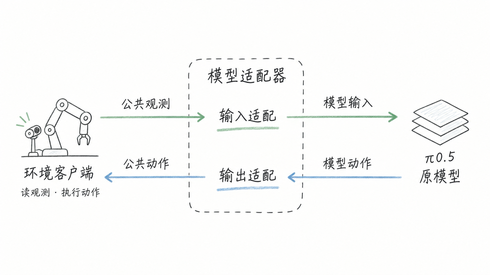
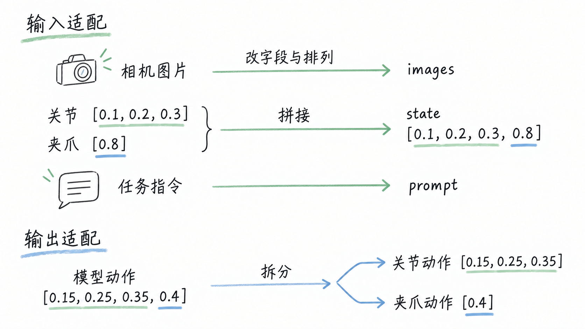
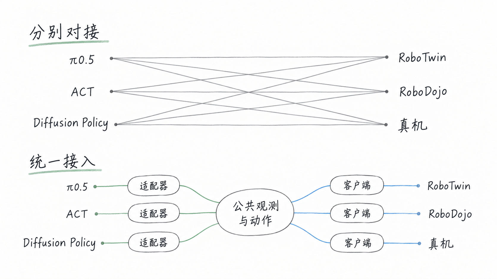

<!-- 根据阅读讨论整理；2026-10-08 调整标题、合并正文并补充示意图。技术说明以论文及官方实现为依据。图中数字仅说明数据拆装，不代表真实机器人配置或实验结果。 -->

[XPolicyLab](https://arxiv.org/abs/2608.09892) 处理的是机器人模型与执行环境之间的接入问题。环境提供图片、机器人状态和任务指令，模型预测动作；它约定两端怎样交换这些数据，让接入代码能够在不同评测与部署场景中复用。

**输入适配和输出适配通常放在同一个模型适配器里。** 输入侧把观测整理成模型需要的格式，输出侧把预测结果整理成环境能够读取的动作字段。读取相机、运行仿真和控制机器人，则由环境一侧负责。

简单讲就是一个适配器，帮大家节约花费在适配上的时间。

## 接入流程

假设要让 π0.5 在仿真中拿起杯子。仿真器已经能提供相机图片和关节状态，但它给出的字段名、图片数组排列和状态顺序，未必符合 π0.5 的输入要求。模型预测出一串数值后，还需要知道哪些数值控制手臂，哪些控制夹爪，再交给仿真器执行。

自行对接时，这些工作通常写在一段同时了解模型和环境的程序里：取观测、改格式、调用模型、拆动作、发送控制指令。只有一组模型和环境时，这样做很直接；换成真机，读取相机和发送动作的代码会变，换成 ACT，模型调用和输入输出格式又要调整。如果两端的逻辑混在一起，每换一端，都可能重新改一遍对接程序。

XPolicyLab 将这段程序的职责分开。**模型适配器负责模型的格式，环境客户端负责环境的接口。** 客户端先把环境观测整理成公共格式，适配器再把它转换成模型输入；动作返回时，沿相反方向转换和执行。两端共同遵守的是观测与动作的约定。[项目说明](https://github.com/XPolicyLab/XPolicyLab#-framework-overview)

*图 1：适配器的位置。箭头表示数据流向，输入适配与输出适配属于同一个模型适配器；动作仍由原模型预测。*

## 数据适配

π0.5 的这两侧转换都写在 [`policy/Pi_05/model.py`](https://github.com/XPolicyLab/XPolicyLab/blob/main/policy/Pi_05/model.py) 中。接收观测时，`update_obs()` 调用 `encode_obs()`，整理图片、机器人状态和任务指令。整个过程是按模型要求改字段和组织数组。

例如，公共观测中的头部相机可能叫 `cam_head`，适配器找到这张图，把它放到模型使用的 `cam_high` 字段，并调整图片数组的排列方式。关节与夹爪状态按机器人配置拼成 `state`，任务指令放进 `prompt`。这些处理准备好了模型需要的数据，随后仍由 π0.5 自己的 `infer()` 完成动作预测。

状态拼接和动作拆分由公共工具完成。用三个关节、一个夹爪举例：输入时，把关节状态 `[0.1, 0.2, 0.3]` 与夹爪状态 `[0.8]` 拼成 `[0.1, 0.2, 0.3, 0.8]`；输出时，如果模型预测 `[0.15, 0.25, 0.35, 0.4]`，就把前三个数取作关节动作，最后一个数取作夹爪动作。配置说明了各部分有多少维，代码据此检查长度并拆装。双臂情况下，顺序是左臂、左夹爪、右臂、右夹爪。[拼接与拆分实现](https://github.com/XPolicyLab/XPolicyLab/blob/main/utils/process_data.py)

*图 2：数据适配的简化例子。输入状态和输出动作是两组不同的数据；真实维数和动作含义由机器人与模型配置决定。*

模型一次预测多步动作时，输出侧逐步拆开，再由客户端送给环境执行。这里的“适配”解决了数据如何交接的问题，实际接入仍需核对单位、关节顺序和控制方式。例如，一个模型输出关节位置，某个环境却要求关节速度，仅仅把数组拆成相同字段并不能让它正确执行。

## 接口复用

接入多个模型与环境时，这种分工才更能体现价值。分别对接三个模型与三个环境，会形成九组连接；采用共同接口后，每个模型实现自己的适配器，每个环境实现自己的客户端。新增模型时，已有客户端可以继续使用；新增环境时，也可以沿用已经接入的模型适配器。

*图 3：对接关系的示意。论文中的 O(NM) → O(N+M) 描述这类集成关系的减少，并不表示每次接入的工作量完全相同。*

因此，从仿真切到真机，主要变化落在读取传感器和执行控制的环境一侧；从 π0.5 切到 ACT，模型一侧负责各自的处理和调用。在观测与动作表示匹配的前提下，两端可以分别复用。共同接口还规定了更新观测、获取动作、批量调用和重置回合等操作，避免每个模型都需要另一套评测调用方式。[论文接口设计](https://arxiv.org/html/2608.09892v3#S3)

复用还依赖运行环境的分离。模型和仿真器往往需要不同的软件依赖，XPolicyLab 让模型服务与环境客户端运行在独立进程中，通过网络交换观测和动作。模型可以放在 GPU 服务器上，客户端留在仿真机器或机器人旁边，各自使用所需的依赖。[服务架构](https://github.com/XPolicyLab/XPolicyLab#-framework-overview)

这与 LLM 领域的通用调用层有相似之处。[LiteLLM](https://docs.litellm.ai/docs/) 也用共同的调用与返回格式连接不同模型。适配器本身是已有的软件工程做法；XPolicyLab 的贡献主要在于，围绕机器人观测、动作和回合状态建立共同接口，配合依赖隔离、现成适配器与接入流程，让这些代码可以被多个评测和部署场景复用。

统一接入也能减少重复处理带来的接口错误，让评测更容易复现。具体任务和评分规则仍由 RoboTwin 等评测平台决定；模型在真机上能否做好任务，则取决于权重、训练数据、相机配置和动作空间是否适合。XPolicyLab 降低的是接入与维护成本，接通接口之后，机器人能力仍需要实际验证。

## 参考资料

- [XPolicyLab 论文](https://arxiv.org/abs/2608.09892)
- [XPolicyLab 项目与框架说明](https://github.com/XPolicyLab/XPolicyLab)
- [π0.5 模型适配器](https://github.com/XPolicyLab/XPolicyLab/blob/main/policy/Pi_05/model.py)
- [状态拼接与动作拆分工具](https://github.com/XPolicyLab/XPolicyLab/blob/main/utils/process_data.py)
- [LiteLLM 官方文档](https://docs.litellm.ai/docs/)
